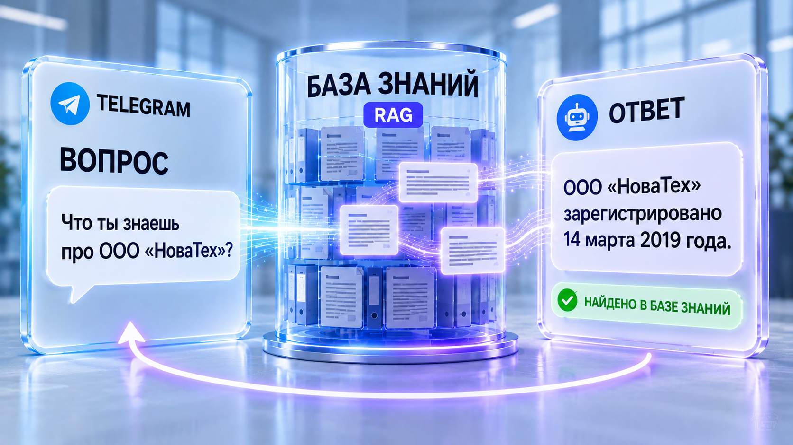
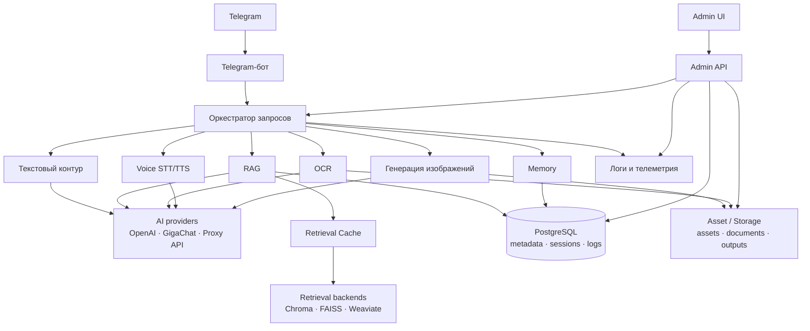

# 🏠 Assistant Flow



⚡ **Корпоративные знания, доступные AI-ассистенту, — с полной наблюдаемостью, а не «чёрным ящиком».**

Assistant Flow — мультимодальная AI-платформа для работы с корпоративными знаниями: Telegram-ассистент (текст, RAG, OCR/Vision, голос STT/TTS, генерация изображений), управляемая база знаний с переключаемыми vector-бэкендами (Chroma / FAISS / Weaviate) и операционная консоль с трассировкой обработки каждого запроса.

- Пользователь задаёт вопрос в Telegram — текстом, голосом или фото — и получает ответ; в RAG-режиме — с блоком «Источники».
- Оператор видит каждую сессию в консоли: этапы pipeline, телеметрию провайдеров, найденные чанки, latency, retrieval cache.
- Администратор развивает базу знаний: индексация, версии документов, параметры поиска, смена vector-бэкенда — с RBAC и журналом аудита.

Assistant Flow не скрывает, как получен ответ: каждая сессия трассируется по этапам, каждый доступ — в журнале аудита.

[▶️ Попробовать live demo](https://af-admin.alex-n8n.site) · [💼 Бизнес-ценность](docs/BUSINESS_VALUE.md) · [🎬 Как это работает](docs/SYSTEM_DEMO.md)

---

## ▶️ Live Demo

🌐 **Операционная консоль:** [af-admin.alex-n8n.site](https://af-admin.alex-n8n.site)

Нажмите **«Войти в демо-режиме»** (read-only) — обзор состояния платформы, AI-сессии, база знаний с диагностикой retrieval, память диалога, журнал аудита. Операции записи (upload, reindex, настройки) недоступны — полный доступ только с админ-токеном.

Скриншоты, живые сессии и типовой сценарий — в [`docs/SYSTEM_DEMO.md`](docs/SYSTEM_DEMO.md); маршрут проверки — [`docs/DEMO_ROUTE.md`](docs/DEMO_ROUTE.md).

---

## ❓ Зачем нужен Assistant Flow

В компаниях знания существуют, но ими сложно пользоваться:

| Подход | Ограничение |
|--------|-------------|
| **Ручной поиск по документам** | регламенты в PDF и папках, инструкции устаревают, поддержка отвечает на одни и те же вопросы |
| **AI-бот «как получится»** | ответ невозможно проверить: почему найден именно этот фрагмент, каким провайдером сгенерирован, что с качеством |
| **LLM без контура эксплуатации** | нет индексации и версий документов, нет трассировки, нет аудита доступа |

**Assistant Flow решает эту проблему**, объединяя в одном контуре:

- **Управляемую базу знаний** — загрузка, индексация, версии, lifecycle документов; visibility-роли при поиске.
- **Мультимодального ассистента** — текст, RAG, OCR/Vision, голос (STT/TTS), генерация изображений.
- **Полную наблюдаемость** — трассировка каждой сессии, телеметрия провайдеров, диагностика retrieval, журнал аудита.
- **Оценку качества RAG** — RAGAS-метрики и ручная валидация, а не «на глаз».

Больше о бизнес-ценности — в [`docs/BUSINESS_VALUE.md`](docs/BUSINESS_VALUE.md).

---

## 🎯 Для кого

- Команды, которые вводят AI-ассистентов по корпоративным базам знаний и хотят контроль, а не «чёрный ящик».
- Владельцы знаний (регламенты, инструкции, справочники), которым нужен управляемый контур индексации.
- Инженеры и операторы, эксплуатирующие AI-сервисы: диагностика, latency, cache, аудит.
- Поставщики решений, которым нужна архитектура «ассистент + операционная консоль» как референс.

---

## ✨ Ключевые возможности

- **Мультимодальный Telegram-ассистент** — текстовый диалог, RAG по базе знаний, OCR/Vision с фото, голос (STT/TTS), генерация изображений.
- **Управляемая база знаний** — загрузка, индексация, версии и lifecycle документов, heavy-RAG safeguards, фоновые задачи reindex (очередь `async_jobs`).
- **Переключаемые vector-бэкенды** — Chroma / FAISS / Weaviate, смена без смены кода (Retrieval Settings).
- **RAG с наблюдаемостью** — найденные чанки с полным текстом и score, latency, retrieval cache OFF/MISS/HIT.
- **Операционная консоль (React)** — 12 разделов: обзор, сводка, сессии по модальностям, документы, логи, память, аудит.
- **Оценка качества RAG** — RAGAS-метрики, ручная валидация ответов, сравнение сессий внутри evaluation run.
- **Память диалога** — контекст в PostgreSQL, диагностика влияния истории на ответ.
- **Безопасность** — Bearer-токен, RBAC на Admin API, демо-вход read-only, журнал аудита, retrieval security по visibility.
- **Эксплуатация** — healthchecks, graceful degradation, multi-stage production-образы.

---

## 🏗️ Краткий обзор архитектуры



- **Telegram-бот + оркестратор** — маршрутизация запросов по модальностям, память диалога.
- **Admin API + Admin UI** — операционная консоль: сессии, документы, retrieval, аудит.
- **Контур базы знаний** — индексация, retrieval security по ролям, retrieval cache, векторные хранилища.

Подробнее — в [`docs/ARCHITECTURE.md`](docs/ARCHITECTURE.md).

---

## 🌐 Публичные точки входа

| Роль | Сервис | Адрес | Назначение |
|------|--------|-------|-----------|
| Пользователь | Telegram-бот | имя задаётся при развёртывании ([DEPLOYMENT_GUIDE](docs/DEPLOYMENT_GUIDE.md) §4) | вопросы во всех режимах |
| Оператор / администратор | Операционная консоль | [af-admin.alex-n8n.site](https://af-admin.alex-n8n.site) (витрина) · localhost:8080 (локально) | обзор, сессии, база знаний, аудит |
| Интегратор | Admin API | localhost:8600 (локально) | REST Admin API |

> 🔓 **Вход в консоль:** по Bearer-токену (`AF_ADMIN_TOKEN`); публичный демо-вход — кнопка «Войти в демо-режиме» (`AF_ADMIN_DEMO_TOKEN`), read-only RBAC. Не корпоративный SSO.

---

## 📚 Документация

### Для заказчиков и менеджеров

| Документ | Описание |
|----------|----------|
| [💼 `docs/BUSINESS_VALUE.md`](docs/BUSINESS_VALUE.md) | Бизнес-проблема, решение, эффект, выгода |
| [🎬 `docs/SYSTEM_DEMO.md`](docs/SYSTEM_DEMO.md) | Скриншоты, live demo, типовой сценарий |
| [🧭 `docs/DEMO_ROUTE.md`](docs/DEMO_ROUTE.md) | Маршрут проверки демо за 5 шагов |
| [🎬 `docs/DEMO_SCENARIOS.md`](docs/DEMO_SCENARIOS.md) | Расширенная матрица демо-проверок |

### Для пользователей и операторов

| Документ | Описание |
|----------|----------|
| [📖 `docs/USER_GUIDE.md`](docs/USER_GUIDE.md) | Руководство пользователя Telegram-ассистента |
| [🎛️ `docs/ADMIN_GUIDE.md`](docs/ADMIN_GUIDE.md) | Руководство администратора консоли |
| [🖥️ `docs/ADMIN_INDEXING.md`](docs/ADMIN_INDEXING.md) | Индексация базы знаний: workflow и safeguard-и |

### Для инженеров и интеграторов

| Документ | Описание |
|----------|----------|
| [🏗️ `docs/ARCHITECTURE.md`](docs/ARCHITECTURE.md) | Архитектурные решения и контуры |
| [⚙️ `docs/OPERATIONS.md`](docs/OPERATIONS.md) | Эксплуатация: compose, порты, backends, диагностика |
| [🚀 `docs/DEPLOYMENT_GUIDE.md`](docs/DEPLOYMENT_GUIDE.md) | Развёртывание с нуля (SOT воспроизводимости) |
| [✅ `docs/DEPLOYMENT_VALIDATION_REPORT.md`](docs/DEPLOYMENT_VALIDATION_REPORT.md) | Отчёт о Deployment Validation |
| [🛡️ `docs/SECURITY_NOTES.md`](docs/SECURITY_NOTES.md) | Доступ, RBAC, аудит, security-контур |
| [📊 `docs/PROJECT_STATE.md`](docs/PROJECT_STATE.md) | Текущее состояние проекта |
| [🎯 `docs/SPEC.md`](docs/SPEC.md) | Продуктовая спецификация |
| [📋 `docs/IMPLEMENTATION_PLAN.md`](docs/IMPLEMENTATION_PLAN.md) | Технический план реализации |
| [🧪 `docs/RAG_SMOKE_TEST.md`](docs/RAG_SMOKE_TEST.md) | Smoke-тест RAG |
| [📂 `docs/PROJECT_STRUCTURE.md`](docs/PROJECT_STRUCTURE.md) | Карта репозитория |
| [🗄️ `database/POSTGRES_SETUP.md`](database/POSTGRES_SETUP.md) | PostgreSQL: схема и миграции |
| [🖼️ `docs/screenshots/MEDIA_INDEX.md`](docs/screenshots/MEDIA_INDEX.md) | Каталог медиаматериалов |

---

## ✅ Статус проекта

Реализованы все ключевые компоненты: текстовый AI-контур, RAG-контур с тремя переключаемыми бэкендами, управляемая индексация, retrieval cache, память диалога, аудио-контур (STT/TTS), операционная консоль (React), security-контур (Bearer + RBAC + журнал аудита; e2e 19/19 PASS), async-воркер фоновых задач, оценка качества RAG (RAGAS), multi-stage production-образы. Живой инстанс работает как витрина (демо-вход read-only).

**GitHub:** репозиторий Assistant Flow (public).

Текущее состояние и следующие шаги — в [📊 `docs/PROJECT_STATE.md`](docs/PROJECT_STATE.md).

---

## 🛠️ Технологии

- **Backend** — Python, FastAPI, PostgreSQL.
- **Vector store** — Chroma / FAISS / Weaviate (переключаемые).
- **Frontend** — React, Vite (операционная консоль).
- **AI-провайдеры** — OpenAI / GigaChat / Proxy API (embeddings отделены от chat).
- **Deploy** — Docker, Docker Compose (`docker-compose.portfolio.yml`).

---

## 🚀 Быстрый запуск

### Локально

```bash
cp .env.example .env
COMPOSE_BAKE=false docker compose -f docker-compose.portfolio.yml up -d --build --remove-orphans
```

| Сервис | URL / порт |
|--------|-----------|
| Admin UI | http://localhost:8080 |
| Admin API | http://localhost:8600 |
| PostgreSQL | 5433 → 5432 (в сети compose) |
| Chroma HTTP | 8001 → 8000 |
| Weaviate HTTP | 8089 → 8080 |

Проверка после запуска:

```bash
curl -sS http://localhost:8600/api/health
# браузер: http://localhost:8080 (UI)
```

Подробные инструкции (требования, сеть, .env, первый запуск, проверки) — [`docs/DEPLOYMENT_GUIDE.md`](docs/DEPLOYMENT_GUIDE.md); эксплуатация и типовые сбои — [`docs/OPERATIONS.md`](docs/OPERATIONS.md).

---

## ⚠️ Ограничения демо

- **Исследовательская платформа (MVP)**: seed-документы — учебный материал для демонстрации RAG, а не корпоративная база знаний.
- **Single-tenant**: нет multi-tenant изоляции и внешнего IAM/OAuth.
- **Heavy RAG на малых VPS**: reindex при конкурентных RAG-запросах может деградировать при 8 GiB RAM.
- Демо-вход в консоль — только чтение (RBAC); перед production требуется корпоративная аутентификация, CI/CD, мониторинг и бэкапы.

---

## 🔑 Ключевые принципы

1. **Ответы прозрачны** — трассировка каждого этапа обработки, от запроса до найденных чанков.
2. **База знаний управляема** — индексация, версии, lifecycle, visibility-роли; не «файлы на диске».
3. **Observability-first** — метрики, телеметрия провайдеров, cache-состояния, журнал аудита.
4. **Честные границы** — Bearer-токены, демо read-only, известные ограничения; MVP перед production.

---

## 📁 Структура проекта

Полная карта каталогов и файлов — в [📂 `docs/PROJECT_STRUCTURE.md`](docs/PROJECT_STRUCTURE.md).

> **Примечание:** внутренние материалы AI Automation Portfolio Lab (например, `task_history/`, черновики архитектурных решений) хранятся вне публичного репозитория и не входят в поставку.