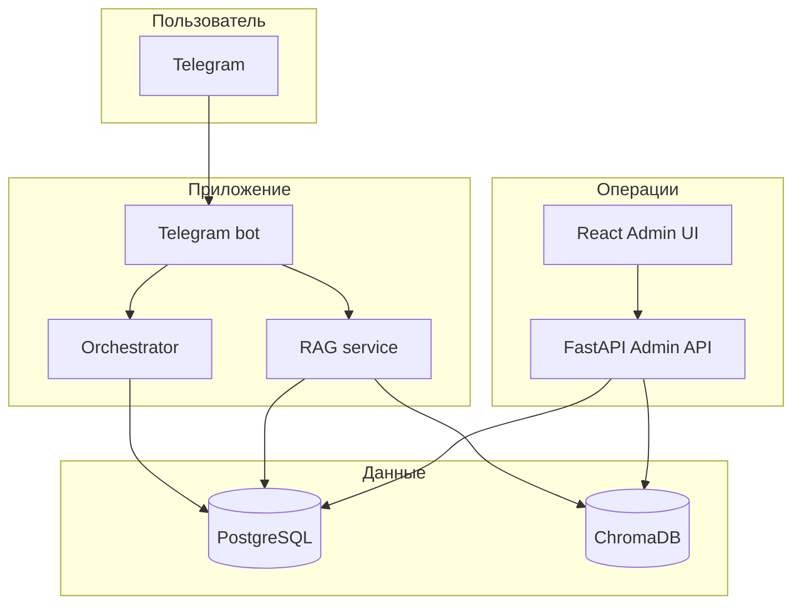

# Assistant Flow

Прототип мультимодальной AI-платформы с упором на **контроль AI-пайплайнов** и **наблюдаемость**: один пользовательский канал (**Telegram**), отдельная административная консоль (**React** + **FastAPI**), данные и телеметрия в **PostgreSQL**, векторный индекс в **ChromaDB**. Репозиторий оформлен как инженерный **portfolio**-проект: здесь видно, как устроены маршрутизация запросов, **RAG**, жизненный цикл документов и диагностика сессий — без претензии на готовый SaaS.

---

## Бизнес-сценарий и идея

Во многих командах знания рассосредоточены по документам, а «общий чатбот» либо игнорирует внутренние материалы, либо даёт ответы без опоры на источники. **Assistant Flow** демонстрирует другой контур: **база знаний под контролем администратора**, запросы пользователей через **Telegram**, ответы с явным разделением режимов (например, свободный текст и **RAG** только для чтения из индекса).

В проекте база знаний не сводится к набору случайно загруженных файлов. Документы проходят отдельный жизненный цикл: загрузка, индексация, хранение метаданных, обновление версий и синхронизация с retrieval-слоем в **ChromaDB**. Пользовательский чат отделён от административного контура управления знаниями: корпус документов поддерживается отдельно и наблюдается через консоль и телеметрию.

Проект также демонстрирует подход, при котором AI-система рассматривается не только как пользовательский интерфейс, но и как управляемый контур обработки запросов с отдельными механизмами диагностики, трассировки и контроля зависимостей.

Проект показывает практические вещи, которые важны в операциях вокруг **LLM**:

- **Контроль AI-пайплайнов** — какие режимы включены, откуда берётся контекст, какие провайдеры задействованы.
- **Наблюдаемость** — что произошло в рамках обработки запроса, какие стадии прошёл пайплайн.
- **Диагностика RAG** — retrieval, чанки, признаки деградации, а не только финальный текст.
- **Жизненный цикл документов** — загрузка, версии, индексация, согласованность с векторным хранилищем.
- **Трассировка execution** — связка событий и логов обработки для разбора инцидентов.
- **Маршрутизация мультимодальных сценариев** — текст, **RAG**, изображения, опционально **STT**/**TTS** по конфигурации, с отображением в административной консоли.
- **Диагностика зависимостей** — health/degraded-состояния, телеметрия сервисов и visibility retrieval-контуров.

Это **прототип** для портфолио и экспериментов с архитектурой, а не готовый коммерческий продукт.

---

## Возможности платформы

- Текстовые ответы в **Telegram** (оркестрация через настраиваемых провайдеров).
- **RAG** по отдельно администрируемой базе знаний (**ChromaDB** + **PostgreSQL** для метаданных и контракта жизненного цикла).
- Генерация изображений (провайдеры **OpenAI**-совместимые / **ProxyAPI** — по конфигурации).
- Опционально голос: **STT** / **TTS** при включённых провайдерах и ключах.
- Загрузка документов и переиндексация через **Admin API** / существующие сценарии индексации (см. `docs/ADMIN_INDEXING.md`).
- **Execution tracing**, стадии обработки и недавние логи в консоли и через `GET /api/logs/recent`.
- **Health** и **degraded**-состояния зависимостей (`GET /api/health`) с отдельной диагностикой retrieval-контура.
- Административная консоль на **React** (**Vite**-сборка) поверх **FastAPI Admin API**.
- Разделение пользовательского интерфейса (**Telegram**) и административного контура мониторинга и диагностики.

---

## Архитектура

Пользовательский трафик идёт в **Telegram-бот** (`interfaces/telegram_bot.py`): оттуда вызываются оркестратор текста/изображений (`core/`), сервис **RAG** (`services/rag_query_service.py`, `services/rag_chroma_store.py`) и при необходимости аудио-пайплайн. **PostgreSQL** хранит пользователей, документы, версии, чанки (метаданные), события intake, `processing_logs` и связанные таблицы. **ChromaDB** хранит эмбеддинги и обеспечивает поиск по коллекции.

Пользовательский и административный контуры разделены. Пользователь взаимодействует только через **Telegram**, тогда как оператор работает через **React Admin UI** и JSON-**Admin API** (`admin_api/`, запуск `run_admin_api.py`): обзор состояния системы, сводки, execution tracing, health/degraded-сигналы, документы, retrieval-диагностика и превью ассетов. Это позволяет анализировать маршруты обработки и поведение пайплайнов отдельно от пользовательского UX.

Оператор смотрит состояние системы через **React Admin UI** (статическая сборка или dev-сервер) и JSON-**Admin API** (`admin_api/`, запуск `run_admin_api.py`): обзор, сводки, логи, документы, превью ассетов. Провайдеры (**GigaChat**, **OpenAI**-совместимый чат и эмбеддинги, **ProxyAPI** для изображений и т.д.) подключаются через слой `providers/` и настройки окружения.

Для локального и portfolio-развёртывания используется **`docker-compose.portfolio.yml`** (**PostgreSQL**, **Chroma**, контейнер бота, **admin-api**, **admin-ui** на **nginx**). Серверный вариант с внешними сетями и **Streamlit**-админкой остаётся в `docker-compose.assistant.yml`. Детальное описание контуров, потоков и телеметрии: **[docs/ARCHITECTURE.md](docs/ARCHITECTURE.md)**.



---

## Консоль мониторинга

Ниже — проход по экранам консоли и паре сценариев в **Telegram**. Для каждого блока сначала краткий смысл экрана, затем скриншот.

### Обзор платформы

Страница **Overview** даёт срез состояния: доступность **PostgreSQL** и **Chroma**, параметры **RAG**, флаги провайдеров и модальностей. Удобно для первичной проверки после деплоя и для сравнения «что должно работать» с фактическими зависимостями.


### Сводка телеметрии

**Summary** агрегирует активность за выбранный горизонт времени: объёмы по маршрутам и стадиям, ошибки, базовая операционная картина без ручного разбора сырых логов.


### Execution tracing и логи

**Logs** показывает недавние записи `processing_logs`: стадии, статусы, укороченные **JSON**-детали. Это опора для разбора конкретной сессии и поиска аномалий в пайплайне.


### RAG pipeline — административная консоль

Экран **RAG** в консоли раскладывает запрос: retrieval, чанки, параметры поиска, признаки **fallback**. Полезно отлаживать качество ответа и понимать, сработал ли контур базы знаний.


### RAG pipeline — Telegram-интерфейс

В **Telegram** пользователь получает ответ с опорой на источники в режиме **RAG** (форматирование и список источников зависят от реализации бота).


### Аудио pipeline (STT / TTS) — административная консоль

Экран **Audio** отражает голосовой контур: распознавание, синтез, ссылки на ассеты, метаданные — когда **STT**/**TTS** включены и сконфигурированы.


### Аудио pipeline — Telegram-интерфейс

В **Telegram** отображаются голосовые сообщения и ответы при включённом аудио-пайплайне.


### Генерация изображений — административная консоль

Страница **Images** показывает цепочку промптов, параметры генерации и телеметрию по обращению к image-провайдеру.


### Генерация изображений — Telegram-интерфейс

Пользователь запрашивает картинку в чате; результат приходит сообщением **Telegram** (в зависимости от настроек провайдера и политик).


### Текстовый pipeline — административная консоль

**Text** в консоли обобщает текстовые запросы: маршрут, модель, токены, задержки — для сопоставления с тем, что видит пользователь в чате.


### Текстовый pipeline — Telegram-интерфейс

Диалог в **Telegram** в текстовом режиме без обязательного **RAG**.


### Управление документами

**Documents** — точка контроля над базой знаний: загрузка, статусы индексации, версии, чанки, согласованность с **Chroma**, превью содержимого. Это как раз тот слой, который отделяет «набросали в чат» от «зафиксировали корпус и поддерживаем его жизненный цикл».


---

## Быстрый старт

Проверенная последовательность для portfolio-стека (**без** ручного запуска **FastAPI** и **Vite** на хосте):

```bash
git clone <repo-url>
cd assistant-flow
cp .env.example .env
docker compose -f docker-compose.portfolio.yml up -d --build --remove-orphans
```

Дальше в браузере: **Admin UI** — [http://localhost:8080](http://localhost:8080), проверка API — [http://localhost:8600/api/health](http://localhost:8600/api/health).

**Порты на хосте** (чтобы не пересекаться с уже запущенным **Postgres** / **Chroma**):

| Сервис | Порт на хосте | Примечание |
|--------|---------------|------------|
| **PostgreSQL** | **5433** | внутри compose-сети: `postgres:5432` |
| **Chroma** | **8001** | внутри сети: `chroma:8000` |
| **FastAPI Admin API** | **8600** | `GET /api/health`, `GET /api/overview`, … |
| **React Admin UI** | **8080** | статика через **nginx** в образе |

При первом создании тома **PostgreSQL** применяются скрипты из `docker-compose.portfolio.yml` (**schema** + **async_jobs**). Если том уже существовал без init — см. [docs/OPERATIONS.md](docs/OPERATIONS.md).

**Переменные окружения:** в `.env` нужно заменить плейсхолдер **`TELEGRAM_BOT_TOKEN`** на токен вида `123456:AA...`, если требуется живой бот. Значение `your_telegram_bot_token` из `.env.example` оставляет контейнер бота в режиме ожидания — **Admin API** и консоль при этом работают. Аналогично для реальных вызовов **LLM** / **ProxyAPI** подставьте рабочие ключи вместо шаблонных строк в `.env`.

**Имя проекта Compose:** если в том же каталоге уже поднимали `docker-compose.assistant.yml`, задайте отдельное имя, чтобы не смешивать контейнеры:

```bash
COMPOSE_PROJECT_NAME=assistant-flow-portfolio docker compose -f docker-compose.portfolio.yml up -d --build --remove-orphans
```

### Удалённый доступ к консоли через SSH tunnel

На **VPS** порты **8080** (**admin-ui**) и **8600** (**admin-api**) должны слушаться на **хосте** (как в `docker-compose.portfolio.yml`). Удобный способ работать с консолью с рабочей машины — локальный перенос портов по **SSH**, без обращения к внутренним адресам контейнеров:

```bash
ssh -N \
  -L 8080:localhost:8080 \
  -L 8600:localhost:8600 \
  root@SERVER
```

(замените `root@SERVER` на свой пользователь и хост, например `deploy@203.0.113.10`)

После установки туннеля на вашем компьютере:

- **Admin UI** — [http://localhost:8080](http://localhost:8080)
- **Admin API** — [http://localhost:8600](http://localhost:8600) (например `GET /api/health`)

Так вы опираетесь только на опубликованные порты хоста; это штатный операционный путь для удалённой отладки. Публикация **UI**/**API** в открытый интернет по постоянному URL — отдельная задача: **reverse proxy**, **TLS**, `ADMIN_API_CORS_ORIGINS`, при необходимости пересборка образа `admin-ui` с нужным `VITE_ADMIN_API_BASE_URL`; см. [docs/OPERATIONS.md](docs/OPERATIONS.md) и [docs/SECURITY_NOTES.md](docs/SECURITY_NOTES.md).

Дополнительно: [docs/ARCHITECTURE.md](docs/ARCHITECTURE.md), [docs/ADMIN_INDEXING.md](docs/ADMIN_INDEXING.md).

---

## Структура проекта

| Каталог / файл | Назначение |
|----------------|------------|
| `interfaces/` | Точка входа **Telegram** |
| `core/` | Оркестрация текст/изображения |
| `services/` | **RAG**, индексация, lifecycle, healthcheck, админ-логика |
| `providers/` | **GigaChat**, **OpenAI**-совместимые клиенты, эмбеддинги, изображения, **STT**/**TTS** |
| `admin_api/` | **FastAPI**: `/api/health`, `/api/overview`, логи, документы, ассеты |
| `frontend/admin-ui/` | **React** + **Vite** операционная консоль |
| `admin_ui/` | Legacy **Streamlit** (в т.ч. `docker-compose.assistant.yml`) |
| `database/` | `schema.sql`, миграции, контракты |
| `docs/` | Архитектура, операции, безопасность, сценарии, скриншоты |
| `docker-compose.portfolio.yml` | Самодостаточный стек для портфолио |
| `docker-compose.assistant.yml` | Серверный compose с внешними сетями |
| `legacy/pem09_source/` | Справочный код курса, **не** используется в рантайме |

---

## Ограничения

- Это **прототип** для демонстрации инженерных решений, не завершённый продукт.
- **Single-tenant**: нет модели мультиарендности и изоляции данных между организациями.
- **Admin API** открыт на уровне сети: **нет встроенного auth / RBAC**; не публикуйте его в интернет без своего контура защиты (**TLS**, **reverse proxy**, **VPN** и т.д.). Подробнее: [docs/SECURITY_NOTES.md](docs/SECURITY_NOTES.md).
- Часть телеметрии и переходов в **degraded**-режим носит **best-effort** характер (без гарантии полной согласованности при деградации зависимостей); при сбоях **PostgreSQL** или **Chroma** поведение документировано в коде и `docs/`, но не гарантируется как в управляемом SaaS.
- Нет готовой «коробочной» **production RBAC** и политик соответствия — их нужно проектировать отдельно, если репозиторий станет основой боевой системы.

---

## Технологии

**Python**, **FastAPI**, **Uvicorn**, **PostgreSQL**, **ChromaDB**, **Docker**, **Docker Compose**, **React**, **TypeScript**, **Vite**, **nginx**, **Telegram Bot API** (**pyTelegramBotAPI**), **Streamlit** (legacy admin), **GigaChat**, **OpenAI**-совместимые API, **ProxyAPI**, **RAG**, **STT**, **TTS**.
