# Assistant Flow User Guide v1

Как **пользоваться** уже запущенной системой. Развёртывание и smoke — [RUNBOOK.md](RUNBOOK.md).

---

## 1. Назначение платформы

Assistant Flow — мультимодальная AI-платформа:

- корпоративная база знаний и RAG;
- текстовый диалог в Telegram;
- голос (STT/TTS), если включено оператором;
- генерация изображений;
- OCR / Vision — текст с фотографий;
- административная консоль для оператора.

---

## 2. Основные интерфейсы

| Интерфейс | Кто | Назначение |
|-----------|-----|------------|
| **Telegram** | Пользователь | Вопросы, RAG, фото, голос, картинки |
| **Admin UI** | Оператор | Диагностика, документы, память, оценка RAG |

Адрес UI после portfolio-запуска: `http://localhost:8080` (см. RUNBOOK).

---

## 3. Подключение к Telegram-боту

Система должна быть уже запущена ([RUNBOOK.md](RUNBOOK.md)).

1. Найдите в Telegram бота по **@username**, который задал оператор в BotFather (в репозитории имени нет).
2. **Start** или `/start`.
3. `/help` — режимы и примеры.

Если бот не отвечает — оператору: RUNBOOK §G (токен, restart).

---

## 4. Сценарии (схемы)

Упрощённые потоки для пользователя и оператора (не полная архитектура системы).

### Текст

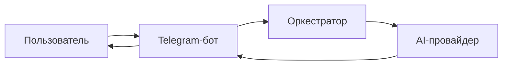
```mermaid
flowchart LR
    U[Пользователь] --> TG[Telegram-бот]
    TG --> ORCH[Оркестратор]
    ORCH --> LLM[AI-провайдер]
    LLM --> TG
    TG --> U
```

### RAG

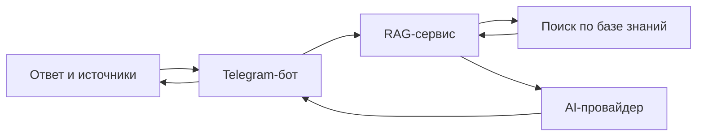
```mermaid
flowchart LR
    U[Вопрос по документам] --> TG[Telegram-бот]
    TG --> RAG[RAG-сервис]
    RAG --> RET[Поиск по базе знаний]
    RET --> RAG
    RAG --> LLM[AI-провайдер]
    LLM --> TG
    TG --> U[Ответ и источники]
```

### OCR

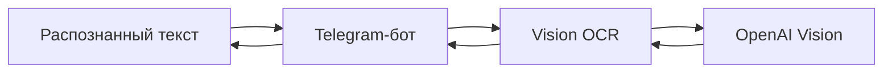
```mermaid
flowchart LR
    U[Фото с текстом] --> TG[Telegram-бот]
    TG --> OCR[Vision OCR]
    OCR --> V[OpenAI Vision]
    V --> OCR
    OCR --> TG
    TG --> U[Распознанный текст]
```

### Индексация документов (оператор)

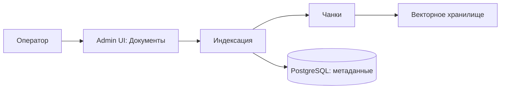
```mermaid
flowchart LR
    OP[Оператор] --> UI[Admin UI: Документы]
    UI --> IDX[Индексация]
    IDX --> CH[Чанки]
    CH --> VDB[Векторное хранилище]
    IDX --> PG[(PostgreSQL: метаданные)]
```

### Кэш retrieval

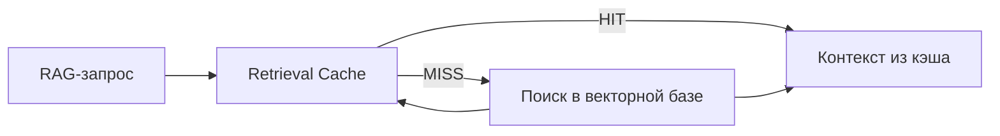
```mermaid
flowchart LR
    Q[RAG-запрос] --> C[Retrieval Cache]
    C -->|HIT| CTX[Контекст из кэша]
    C -->|MISS| RET[Поиск в векторной базе]
    RET --> CTX
    RET --> C
```

---

## 5. Команды Telegram

| Команда | Действие |
|---------|----------|
| `/start` | Приветствие |
| `/help` | Справка по режимам |
| `/mode text` | Диалог и генерация изображений |
| `/mode rag` | Вопросы по базе знаний |
| `/mode ocr` | Распознавание текста на фото |
| `/stats` | Статистика индекса (RAG) |
| `/reset` | Сброс режима и in-memory RAG |
| `/clear` | Очистка контекста RAG (см. `/help`) |

---

## 6. Текстовый режим (`/mode text`)

- Вопросы на естественном языке.
- «Нарисуй…» — генерация изображения.
- Память диалога — если включена оператором (PostgreSQL).

**Пример:** «объясни простыми словами, что такое фотосинтез».

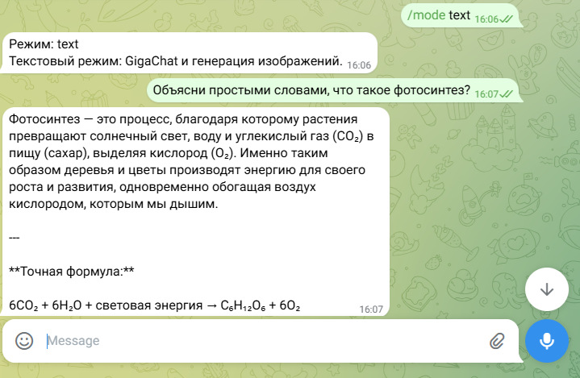

<em>
Пример текстового ответа Telegram-ассистента в режиме обычного диалога.
</em>

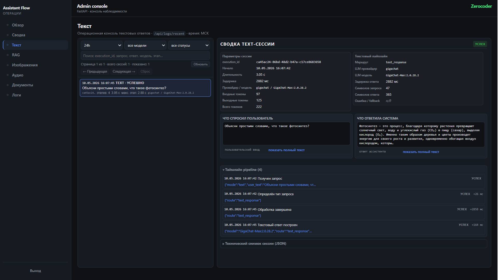

<em>
Консоль текстового pipeline: параметры LLM-запроса, telemetry и таймлайн обработки text-response.
</em>

---

## 7. RAG (`/mode rag`)

Оператор заранее загружает документы (**Документы** в Admin UI).

1. `/mode rag`.
2. Вопрос по содержимому проиндексированных файлов.
3. Ответ + блок **Источники**.

**Пример:** «дай сводку по компании NovaTex» (если такие документы есть в базе).

Без индексации — fallback без релевантных источников.

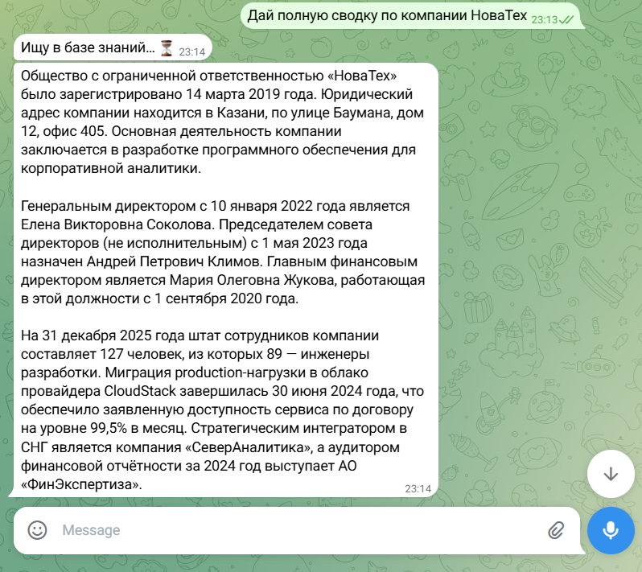

<em>
RAG-ответ Telegram-ассистента на основе корпоративной базы знаний Assistant Flow.
</em>

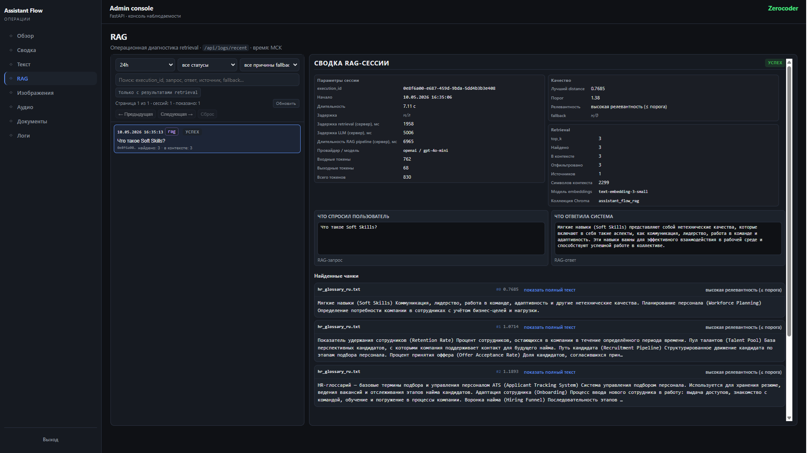

<em>
Операционная консоль RAG-сессий с диагностикой retrieval, latency, cache-state и найденных чанков.
</em>

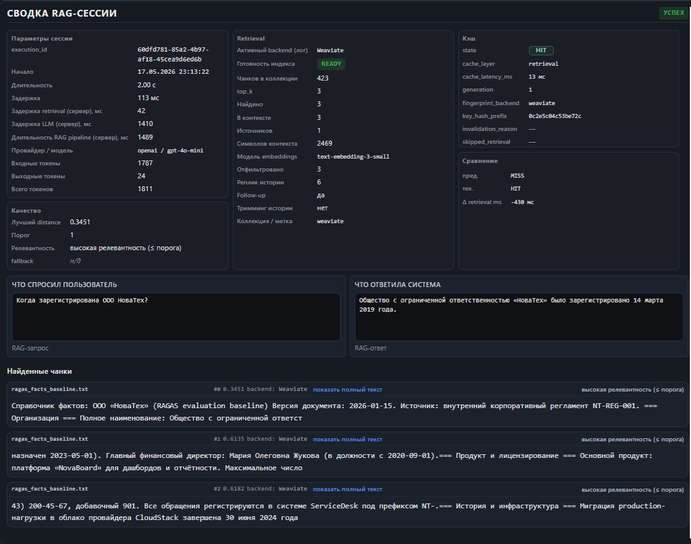

<em>
Расширенная диагностика retrieval: найденные чанки, relevance-score, latency retrieval и состояние retrieval cache.
</em>

---

## 8. Распознавание текста (OCR)

OpenAI Vision; локальный Tesseract не используется.

**Режим OCR:** `/mode ocr` → фото (подпись необязательна).

**В text/rag:** фото + подпись «распознай текст», «OCR», «извлеки текст» и т.п.

**Ответ:** блок «Распознанный текст:». В `/mode ocr` подпись может уточнить задание для vision (один вызов API).

**Примеры:** фото договора; фото + «объясни простыми словами, что написано».

**Ограничения:** размытие, рукопись, мелкий шрифт, сложные таблицы. RAG по картинке без OCR не выполняется.

Оператор смотрит маршрут `vision_ocr` в **Текст** / **Логи**.

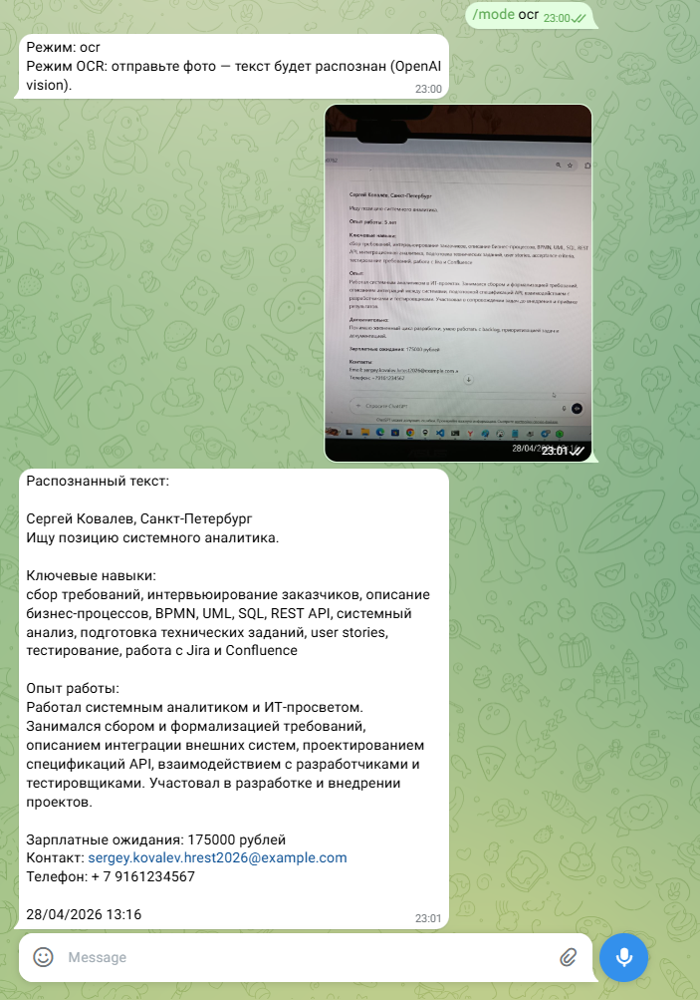

<em>
Пример OCR-обработки изображения в Telegram: распознавание текста средствами OpenAI Vision.
</em>

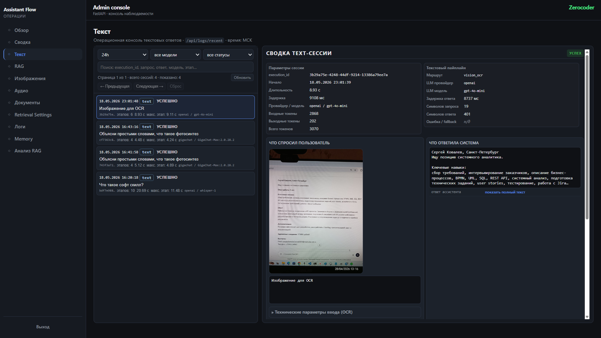

<em>
OCR/Vision pipeline: распознавание изображения, telemetry обработки и извлечённый текст документа.
</em>

---

## 9. Голос

При включённом аудио в окружении: голосовое → текст (и опционально озвучка). По умолчанию в demo — отключено.

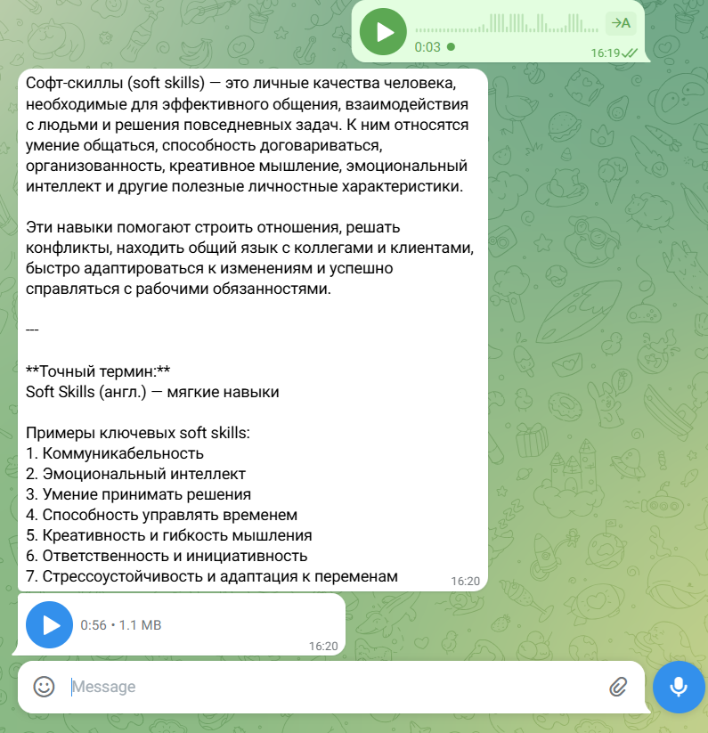

<em>
Пример голосового взаимодействия с Telegram-ассистентом: распознавание речи и генерация аудио-ответа.
</em>

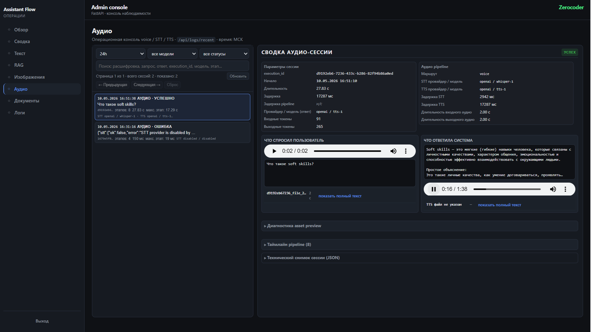

<em>
Операционная консоль voice pipeline: STT/TTS telemetry, аудио-сессия и таймлайн обработки голосового запроса.
</em>

---

## 10. Генерация изображений

`/mode text` → «нарисуй слона в посудной лавке» → изображение в чате.

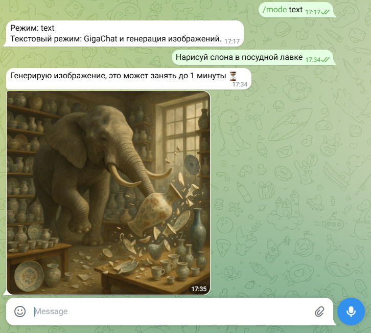

<em>
Пример генерации изображения Telegram-ассистентом по текстовому запросу пользователя.
</em>

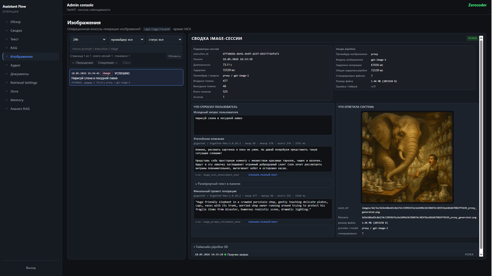

<em>
Консоль генерации изображений: refined prompt, telemetry image pipeline и сохранённый generated asset.
</em>

---

## 11. Память диалога

- История в PostgreSQL (если настроено).
- Контекст для модели ограничен по размеру.
- Оператор: **Memory** (`/memory`) в Admin UI.

`/reset` — сброс режима и in-memory RAG.

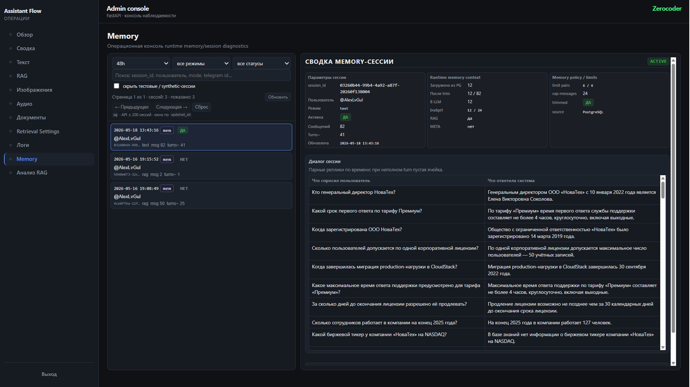

<em>
Диагностика runtime memory: контекст диалога, trimming history и политика ограничения conversational memory.
</em>

---

## 12. Документы (оператор)

Admin UI → **Документы**: загрузка, индексация, reindex, `chunk_count`.

[docs/ADMIN_INDEXING.md](docs/ADMIN_INDEXING.md)

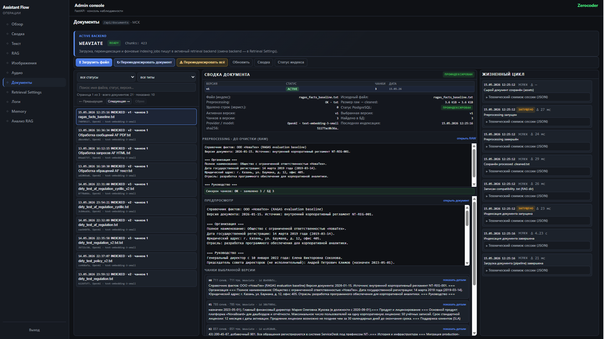

<em>
Управление документами knowledge base: индексация, preprocessing, версии документов и жизненный цикл ingestion pipeline.
</em>

---

## 13. Административная консоль

| Раздел | Путь |
|--------|------|
| Обзор | `/` |
| Сводка | `/summary` |
| Текст | `/text` |
| RAG | `/rag` |
| Изображения | `/images` |
| Аудио | `/audio` |
| Документы | `/documents` |
| Retrieval Settings | `/retrieval` |
| Логи | `/logs` |
| Memory | `/memory` |
| Анализ RAG | `/evaluation` |

Кэш OFF/MISS/HIT — в карточках RAG.

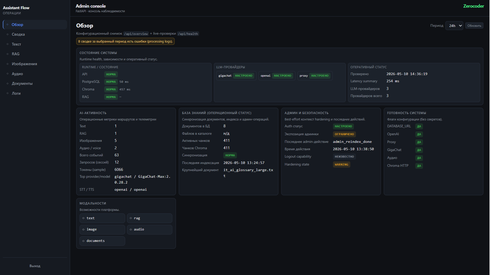

<em>
Обзор состояния платформы Assistant Flow: health-check сервисов, активные AI-провайдеры, retrieval backend и операционные метрики.
</em>

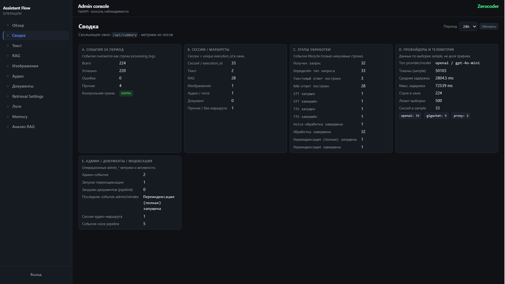

<em>
Сводная операционная статистика платформы: маршруты обработки, этапы pipeline, телеметрия провайдеров и агрегированные метрики.
</em>

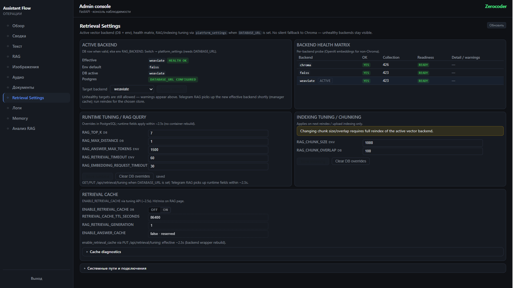

<em>
Панель управления retrieval backend: переключение vector storage, runtime tuning, chunking и cache-настройки RAG.
</em>

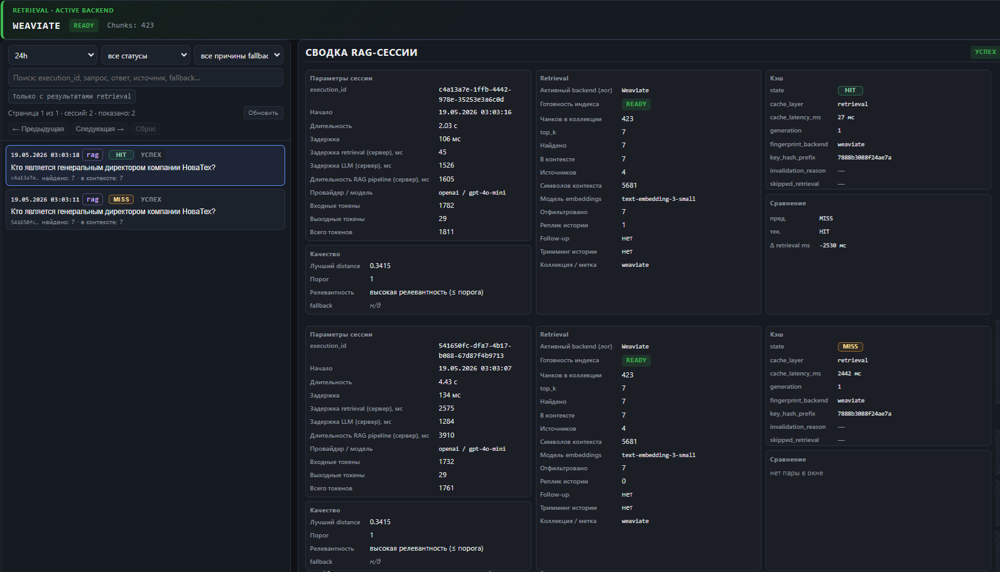

<em>
Сравнение retrieval cache MISS и HIT: снижение latency retrieval при повторном запросе.
</em>

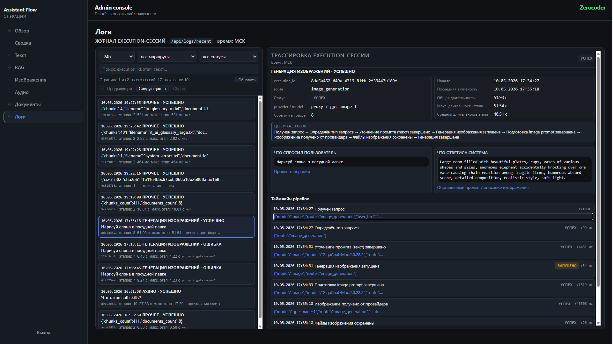

<em>
Журнал execution-сессий и трассировка pipeline обработки запросов Assistant Flow.
</em>

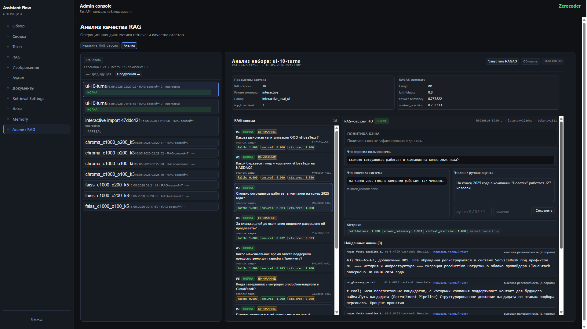

<em>
Консоль оценки качества RAG: RAGAS-метрики, ручная валидация ответов и анализ retrieved chunks.
</em>

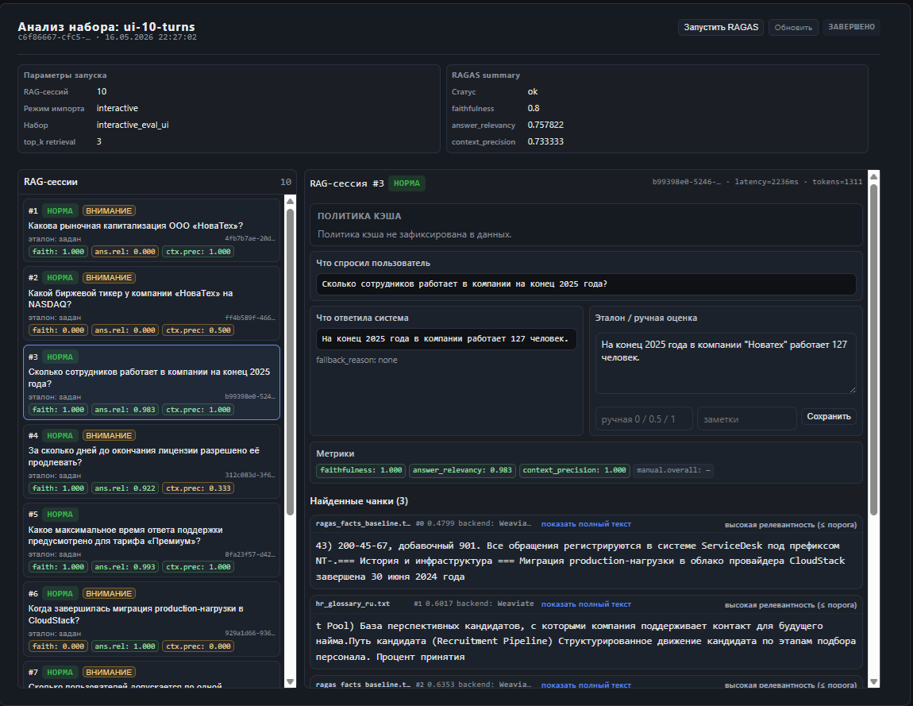

<em>
Сравнение отдельных RAG-сессий внутри evaluation run с отображением метрик quality evaluation.
</em>

---

## 14. См. также

- [README.md](README.md)
- [docs/DEMO_SCENARIOS.md](docs/DEMO_SCENARIOS.md)
- [docs/ARCHITECTURE.md](docs/ARCHITECTURE.md) — устройство системы
