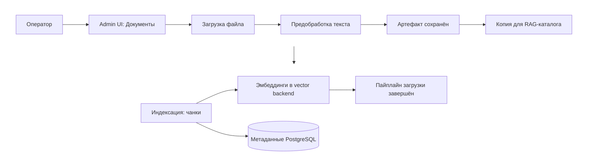
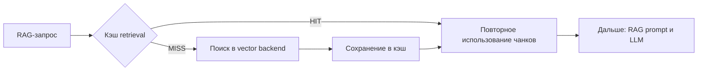

# 🎛️ Assistant Flow — руководство администратора консоли

Как пользоваться операционной консолью Assistant Flow: обзор состояния, база знаний, сессии по модальностям, наблюдаемость. Развёртывание — [🚀 `DEPLOYMENT_GUIDE.md`](DEPLOYMENT_GUIDE.md); модель доступа — [🛡️ `SECURITY_NOTES.md`](SECURITY_NOTES.md).

**Статус:** актуально на 2026-09-15.

---

## 🔐 1. Вход и режимы доступа

- Токены заданы в `.env` (`AF_ADMIN_TOKEN`, `AF_ADMIN_DEMO_TOKEN`) → при открытии консоли открывается экран входа: введите токен или нажмите **«Войти в демо-режиме»** (read-only; демо-токен запечён в UI при сборке).
- Токены не заданы → консоль открывается без авторизации (локальный режим).
- **Выйти** — кнопка в боковой панели: сбрасывает сессию (запрос `/api/auth/logout`).
- Демо-вход видит базу знаний в том же объёме, что и сотрудник (12 документов; скрыт один документ с visibility `restricted`), операции записи недоступны (403).
- Подробности (режимы, legacy Basic-аутентификация, RBAC, аудит) — [🛡️ `SECURITY_NOTES.md`](SECURITY_NOTES.md).

Консоль: [af-admin.alex-n8n.site](https://af-admin.alex-n8n.site) (витрина) или `http://localhost:8080` (локально).

---

## 🧩 2. Раскладка бокового меню

| Группа | Раздел | Путь |
|--------|--------|------|
| Система | Панель состояния | `/` |
| Система | Retrieval Settings | `/retrieval` |
| База знаний | Документы | `/documents` |
| Модальности | Текст | `/text` |
| Модальности | RAG | `/rag` |
| Модальности | Изображения | `/images` |
| Модальности | Аудио | `/audio` |
| Аналитика | Сводка | `/summary` |
| Аналитика | Анализ RAG | `/evaluation` |
| Наблюдаемость | Логи | `/logs` |
| Наблюдаемость | Memory | `/memory` |
| Наблюдаемость | Журнал аудита | `/audit` |
| Справка | Обозначения | `/legend` |

Раздел **Справка → Обозначения** — расшифровка всех статус-чипов и значков консоли.

---

## 🩺 3. Панель состояния (`/`)

Состояние платформы: health-check сервисов, активные AI-провайдеры, retrieval backend, состояние индекса и документов, ключевые hardening-индикаторы (авторизация, аудит).

<em>
Обзор состояния платформы Assistant Flow: health-check сервисов, активные AI-провайдеры, retrieval backend и операционные метрики.
</em>

---

## 📄 4. База знаний: Документы

Admin UI → **Документы**: загрузка, индексация, reindex, `chunk_count`, версии документов, фоновые задачи reindex (панель «Фоновые задачи»; очередь `async_jobs` потребляет воркер внутри admin-api).

<em>
Управление документами knowledge base: индексация, preprocessing, версии документов и жизненный цикл ingestion pipeline.
</em>

Workflow индексации и safeguard-и — [🖥️ `ADMIN_INDEXING.md`](ADMIN_INDEXING.md).

### Схема индексации

*Стадии в логах:* `admin_document_uploaded_raw` → `document_preprocessing_started` → `document_preprocessing_done` → `document_processed_artifact_saved` → `document_compatibility_file_written` → `document_indexing_started` → `document_indexing_done` → `document_upload_pipeline_done`.

---

## ⚙️ 5. Retrieval Settings (`/retrieval`)

Переключение vector storage (Chroma / FAISS / Weaviate), runtime tuning (например `rag_top_k`), chunking и cache-настройки RAG.

<em>
Панель управления retrieval backend: переключение vector storage, runtime tuning, chunking и cache-настройки RAG.
</em>

---

## 🔍 6. RAG: сессии и кэш

Раздел **RAG** — все RAG-сессии: запрос, найденные чанки, latency, состояние retrieval cache. Раздел **Текст** — текстовые сессии с параметрами LLM-запроса и таймлайном; **Изображения** и **Аудио** — соответствующие модальности.

Кэш retrieval: повторные RAG-запросы переиспользуют найденный контекст; в карточках сессий видно OFF / MISS / HIT и `retrieval_latency_ms`.

*В логах:* поля `retrieval_cache_hit` / `retrieval_cache_miss` внутри `rag_answer_done`.

<em>
Сравнение retrieval cache MISS и HIT: снижение latency retrieval при повторном запросе.
</em>

---

## 📊 7. Аналитика: Сводка и Анализ RAG

- **Сводка** — агрегированная операционная статистика: маршруты обработки, этапы pipeline, телеметрия провайдеров.
- **Анализ RAG** — RAGAS-метрики, ручная валидация ответов, сравнение сессий внутри evaluation run.

Скриншоты обеих панелей — [🎬 `SYSTEM_DEMO.md`](SYSTEM_DEMO.md) § Наблюдаемость и качество RAG.

---

## 📜 8. Наблюдаемость: Логи, Memory, Журнал аудита

- **Логи** — журнал execution-сессий: каждая сессия с этапами pipeline, включая однорядные события (например, сброс памяти `memory_session_cleared`).
- **Memory** — диалоговые сессии памяти: реплики, контекст, влияние истории на ответ; событие `memory_session_cleared` фиксирует ротацию сессии (в т.ч. после `/reset` у пользователя).
- **Журнал аудита** — обращения к Admin API: действие, ресурс, роль, IP. В демо-режиме — только просмотр.

<em>
Журнал execution-сессий и трассировка pipeline обработки запросов Assistant Flow.
</em>

<em>
Диагностика runtime memory: контекст диалога, trimming history и политика ограничения conversational memory.
</em>

---

## 🧭 9. Типовой сценарий оператора

1. Загрузить документы (**Документы**) — платформа проиндексирует базу знаний (стадии видны в карточке документа и в **Логах**).
2. Проверить индекс: `/stats` в Telegram или карточки документов (`chunk_count`, статус).
3. Задать RAG-вопрос пользователем (**RAG**-раздел консоли — трассировка чанков, score, latency, cache).
4. Свести качество: **Анализ RAG** (RAGAS) и **Сводка** (агрегаты).

---

## 📚 10. Связанные документы

- [🏠 `README.md`](../README.md) — точка входа в проект.
- [🖥️ `ADMIN_INDEXING.md`](ADMIN_INDEXING.md) — индексация базы знаний: workflow и safeguard-и.
- [📖 `USER_GUIDE.md`](USER_GUIDE.md) — руководство пользователя Telegram-ассистента.
- [🎬 `SYSTEM_DEMO.md`](SYSTEM_DEMO.md) — скриншоты и типовой сценарий.
- [🛡️ `SECURITY_NOTES.md`](SECURITY_NOTES.md) — модель доступа, RBAC, аудит.
- [⚙️ `OPERATIONS.md`](OPERATIONS.md) — эксплуатация и типовые сбои.