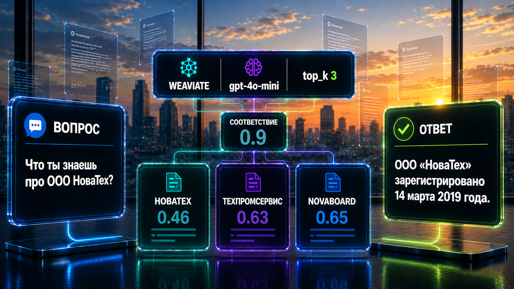
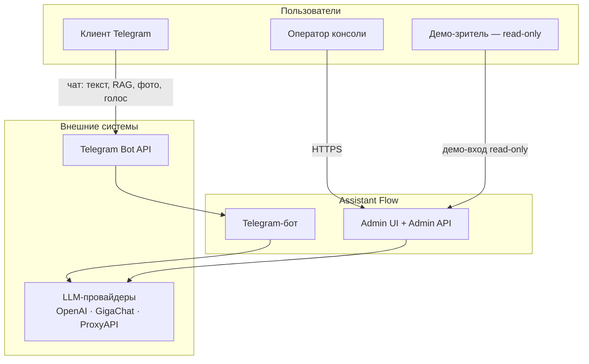
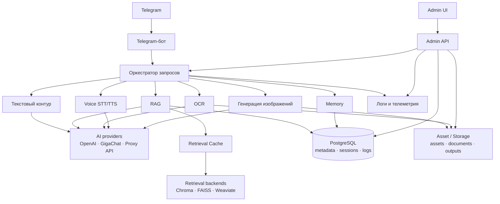
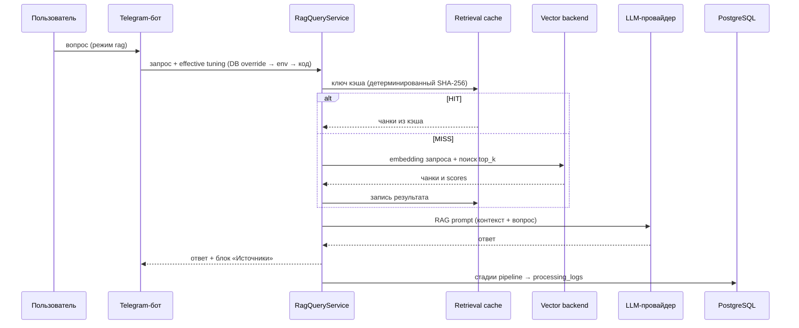
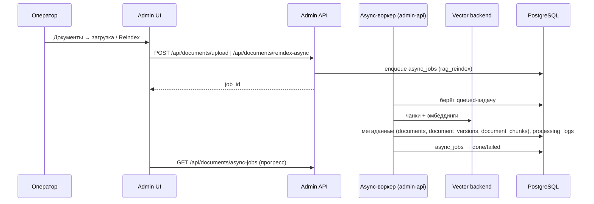
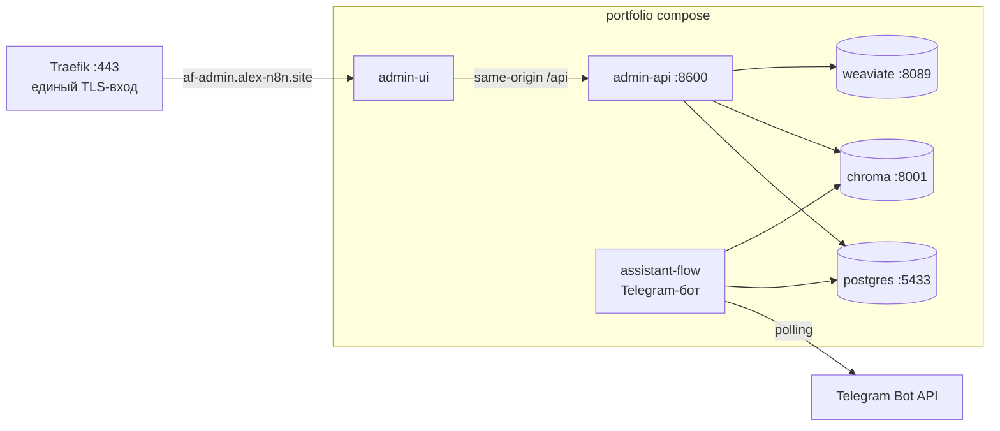

# 🏗️ Архитектура Assistant Flow



**Проект:** assistant-flow · **Версия:** 1.0 · **Дата:** 2026-09-15 · **Статус:** актуально

Документ — инженерный reference проекта (слой 3): границы компонентов, архитектурные принципы, потоки обработки, модель данных и развёртывания. Аудитория — инженеры сопровождения и развития. Пользовательский вход в проект — [README.md](../README.md); развёртывание с нуля — [DEPLOYMENT_GUIDE.md](DEPLOYMENT_GUIDE.md).

Рантайм — `core/`, `services/`, `providers/`, `interfaces/`, `repositories/`, `admin_api/`, `frontend/admin-ui/`.

---

## 🎯 1. Архитектурные принципы

- **Пользовательский контур — только Telegram**: конечный пользователь не обращается к Admin API, базам и LLM-провайдерам напрямую.
- **Операционный контур — Admin UI + Admin API**: React-консоль ходит только к FastAPI Admin API (same-origin `/api`), не к базам и провайдерам.
- **Единый оркестратор** маршрутизации запросов по модальностям (`core/orchestrator.py`).
- **PostgreSQL — source of truth** операционных данных: документы, версии, метаданные чанков, логи, память, настройки, аудит. Векторные backend — **производные хранилища**, восстановимы переиндексацией из документов.
- **Векторный backend переключаем** (chroma / faiss / weaviate) через фабрику retrieval; активный backend — `platform_settings.active_rag_backend` (PostgreSQL), а не env-переменная.
- **Runtime-тюнинг — не хардкод**: параметры поиска (`rag_top_k` и др.) резолвятся по цепочке DB override → env → default кода (`RetrievalTuningResolver`).
- **Провайдеры разделены**: chat-LLM и embeddings — отдельные провайдеры (OpenAI / GigaChat / ProxyAPI-совместимые).
- **Индексация отделена от чата**: загрузка/реиндекс — Admin UI, CLI или async-воркер; Telegram-контур базу знаний не пишет.
- **Observability-first**: стадии pipeline фиксируются в `processing_logs`, health/degraded-статусы зависимостей, аудит привилегированных действий.

---

## 🌐 2. Схема верхнего уровня

### Context (акторы и внешние системы)



### Контейнеры и данные



---

## 🧭 3. Контуры

Система разделена на **пользовательский** и **операционный** контуры.

| Контур | Назначение |
|--------|------------|
| **Telegram** | Единственный канал для конечного пользователя: диалог, режимы, RAG без загрузки корпуса в чат |
| **Admin UI + Admin API** | Обзор здоровья, документы, RAG-диагностика, Memory, Audio, Images, Evaluation — панель оператора |
| **PostgreSQL** | Документы, версии, метаданные чанков, `processing_logs`, память сессий (не векторы) |
| **Векторные backend** | Chroma / FAISS / Weaviate — эмбеддинги и поиск; синхронизация с Postgres при индексации |
| **Кэш поиска** | SQLite (`storage/cache/`) — ускорение повторных RAG-запросов, наблюдаемость OFF/MISS/HIT |
| **Индексация** | Отделена от пользовательского чата: Admin UI, CLI `scripts/admin_index_documents.py` |

---

## 🧩 4. Основные компоненты

### Telegram bot

- `interfaces/telegram_bot.py` — long polling (**pyTelegramBotAPI**).
- Режимы `text` / `rag` — `utils/telegram_user_state.py`; память диалога — PostgreSQL (`chat_sessions`, `chat_messages`) при настроенном `DATABASE_URL`.
- Плейсхолдер токена (portfolio): polling не стартует, контейнер ждёт реальный токен.

### Orchestrator

- `core/orchestrator.py` — **PromptOrchestrator**: текст, изображения, маршрутизация к провайдерам.
- `RequestLogger` (**SQLite** `logs.db`) на части путей.

### RAG и retrieval

- `services/rag_query_service.py` — поиск + ответ LLM, диагностика чанков (`services/rag_types.py`).
- Абстракция backend: Chroma, FAISS, Weaviate через фабрику retrieval (`services/retrieval/`).
- `services/admin_knowledge_indexer.py` + `scripts/admin_index_documents.py` — индексация корпуса.
- `services/cache/caching_retrieval_backend.py` — обёртка кэша с live-настройкой из БД.

### FastAPI Admin API

- `admin_api/`, `run_admin_api.py` (порт **8600**).
- `/api`: `health`, `overview`, `summary`, `logs`, `documents`, `assets`, retrieval settings, evaluation, security audit и др.
- Асинхронный слой: очередь `async_jobs` (миграция 004) + воркер-поток внутри admin-api (`rag_reindex`), reclaim stale-`running` на старте.
- Аутентификация и RBAC: Bearer-токены консоли (`AF_ADMIN_TOKEN` — admin, `AF_ADMIN_DEMO_TOKEN` — demo read-only), permission-проверки на маршрутах, журнал аудита — [SECURITY_NOTES.md](SECURITY_NOTES.md).

### React Admin UI

- `frontend/admin-ui/` — **Vite** + **React**.
- Разделы: Обзор, Сводка, Текст, RAG, Изображения, Аудио, Документы, Retrieval Settings, Логи, Memory, Анализ RAG.
- `VITE_ADMIN_API_BASE_URL` при сборке образа.

### PostgreSQL

- `database/schema.sql` (snapshot), контракт: `database/db_contract.md`.
- Доступ: `repositories/`, сервисы lifecycle.

### Провайдеры

- `providers/` — GigaChat, OpenAI-совместимый чат, эмбеддинги, изображения, STT/TTS (`disabled` по умолчанию).

### Evaluation

- RAGAS и ручная оценка — Admin UI **Анализ RAG**, опционально `ENABLE_RAGAS_EVALUATION`.

### Asset storage

- `services/asset_repository_factory.py` — превью изображений/аудио через Admin API.

---

## 🗄️ 5. Данные и хранилища

| Хранилище | Содержимое | Пишут | Читают |
|-----------|------------|-------|--------|
| **PostgreSQL** (SOT) | операционные данные — инвентарь ниже | бот, admin-api (+ воркер), CLI | консоль, бот, RAG-контур |
| **Vector backend** (chroma / weaviate / faiss) | чанки + эмбеддинги — **производное** хранилище | воркер индексации, CLI (`admin_index_documents.py`) | RAG-контур |
| **Retrieval cache** (SQLite `storage/cache/`) | результаты RAG-поиска | `caching_retrieval_backend` | RAG-контур |
| **logs.db** (SQLite) | технические записи провайдеров | `RequestLogger` | консоль (частично) |
| **Файлы**: `data/documents`, `storage/assets`, `outputs` | исходные документы, превью, генерации | upload pipeline, модальности | Admin API, Telegram |

Инвентарь таблиц PostgreSQL (по группам):

- **Документы:** `documents`, `document_versions`, `document_chunks`, `indexing_jobs`.
- **Диалог и память:** `chat_sessions`, `chat_messages`, `user_channel_identities`, `user_preferences`.
- **Наблюдаемость:** `processing_logs`, `intake_events`, `request_logs`, `error_logs`, `usage_metrics`, `generated_assets`, `outbox` — все связаны `execution_id`.
- **Конфигурация:** `platform_settings` (активный retrieval backend, кэш, параметры безопасности).
- **Identity и безопасность:** `app_users`, `auth_login_events`, `admin_audit_log`.
- **Фоновые задачи:** `async_jobs` (тип, payload, статус, попытки; воркер — поток admin-api).
- **Оценка качества:** `evaluation_dataset`, `evaluation_dataset_item`, `evaluation_run`, `evaluation_item`, `evaluation_metric_fact`.

Контракт схемы и правило её изменения — `database/db_contract.md` (SOT); снапшот — `database/schema.sql`. Автоматическая ретенция/ротация записей не реализованы — очистка относится к ручным операциям ([OPERATIONS.md](OPERATIONS.md)).

---

## 🔀 6. Потоки обработки

### Text

Telegram → оркестратор → GigaChat (и связанные сервисы) → ответ; lifecycle в `processing_logs` при Postgres.

### RAG

Режим `rag`: **read-only** поиск по векторному backend → контекст → LLM с источниками → диагностика в Telegram и Admin UI.



### Image / Audio

Изображения: оркестратор → image-провайдер → ассет в `storage/assets` → отправка в чат.  
Аудио: STT → текстовый/RAG-путь; TTS при включении.

### OCR / Vision

Отдельный маршрут `vision_ocr` (не локальный Tesseract).

```text
Telegram: фото или image/* document
    → run_telegram_ocr_flow (interfaces/telegram_bot.py)
    → caption_requests_ocr() или режим /mode ocr
    → VisionOcrService (services/vision_ocr_service.py)
    → OpenAIChatProvider.extract_text_from_image (vision API)
    → ответ «Распознанный текст: …» в чат
    → lifecycle: ocr_started / ocr_done / ocr_error → processing_logs
    → входной файл → AssetRepository (storage/assets)
```

| Условие | Поведение |
|---------|-----------|
| `/mode ocr` | любое фото обрабатывается как OCR |
| `/mode text` или `rag` | OCR только при подписи с маркерами («распознай», «OCR», «извлеки текст», …) |
| Иначе | подсказка включить OCR; RAG по картинке без OCR не выполняется |

Подпись в `/mode ocr` дополняет vision-prompt (один вызов API). Диагностика в Admin UI — семейство **Текст**, route `vision_ocr`.

### Document indexing

Оператор: Admin UI **Документы** или CLI → чанки → векторный backend + Postgres (`documents`, `document_versions`, `document_chunks`, события). Telegram этот путь не использует.



---

## 👁️ 7. Наблюдаемость

- **processing_logs** (PostgreSQL) — стадии, `execution_id`, JSON-детали для консоли.
- **logs.db** (SQLite) — технические записи провайдеров; не смешивать со схемой Postgres без явной связи.
- **GET /api/health** — postgres, chroma, rag, LLM; статус `degraded` при частичных сбоях.
- **admin_audit_log** — привилегированные действия и обращения к Admin API (включая отказы 401/403).

Страницы: Overview, Summary, Logs; модальные экраны по модальностям.


<p align="center"><em>
Расширенная диагностика retrieval: найденные чанки, relevance-score, latency retrieval и состояние retrieval cache.
</em></p>


<p align="center"><em>
Журнал execution-сессий и трассировка pipeline обработки запросов Assistant Flow.
</em></p>

---

## 🚀 8. Развёртывание

### Portfolio (канонический GitHub/demo)



Команда, порты и полный порядок развёртывания: [DEPLOYMENT_GUIDE.md](DEPLOYMENT_GUIDE.md).

### Server (продвинутый)

`docker-compose.assistant.yml` — внешние сети, Traefik, `.env.server`. Не основной путь для клона репозитория.  
Исторический Streamlit (`admin_ui/`) в server-compose **не** заменяет React Admin UI.

---

## ⚠️ 9. Ограничения

- Прототип / single-tenant; нет multi-tenant изоляции и external IAM.
- Потеря тома Chroma/Weaviate = переиндексация.
- Retrieval security активен в пользовательском контуре (роли guest/employee/admin по visibility), FAISS — post-filter.

Риски и границы security-контура: [SECURITY_NOTES.md](SECURITY_NOTES.md). Операции: [OPERATIONS.md](OPERATIONS.md).