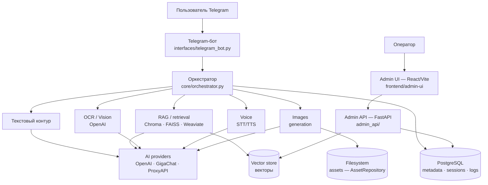

# 📋 IMPLEMENTATION PLAN — Assistant Flow

> **Ретроспективный план** (2026-09-03): фиксирует архитектуру и фактическую последовательность реализации в соответствии с правилами APL. Продуктовый контур — [SPEC.md](SPEC.md).

---

## 1. Архитектура решения

Ключевые архитектурные решения:
- Оркестратор — единственная бизнес-точка входа; Telegram-хэндлеры тонкие.
- PostgreSQL — source of truth для метаданных; векторное хранилище — только векторы; файлы — на файловой системе (`AssetRepository` абстракция, готовность к S3).
- Retrieval через нативный API Chroma (LangChain retrieval снят с основного пути); embeddings-провайдер отделён от chat-провайдера.
- Admin-функциональность отделена от пользовательского бота.
- Graceful degradation вместо crash-loop (Chroma недоступен → текст/изображения работают, RAG — фолбэк).
- Observability-first: каждый маршрут пишет этапы в `processing_logs`, пропущенная телеметрия видима в UI.

## 2. Состав компонентов

| Компонент | Расположение | Роль |
|-----------|--------------|------|
| Telegram-бот | `interfaces/telegram_bot.py`, `run_telegram_bot.py` | Пользовательские сценарии |
| Оркестратор | `core/orchestrator.py` | Маршрутизация запросов по модальностям |
| Сервисы | `services/` | RAG (`rag_query_service`, `rag_chroma_store`), healthchecks, индексация, memory, lifecycle, security (`services/security/`) |
| Admin API | `admin_api/` | `/api/...` для консоли, auth, RBAC, аудит |
| Admin UI | `frontend/admin-ui/` | React/Vite операционная консоль |
| Провайдеры | `providers/` | OpenAI / GigaChat / ProxyAPI, embeddings |
| Репозитории | `repositories/` | PostgreSQL доступ |
| Схема БД | `database/schema.sql` + `database/migrations/002–008` | Snapshot + идемпотентная цепочка миграций |
| Консоль оценки | `evaluation/` | RAGAS-датасеты, evaluation runs |

## 3. Модель данных (основные области PostgreSQL)

`documents` / `document_versions` / `document_chunks`, `indexing_jobs`, `async_jobs` (очередь фоновых задач, воркер в admin-api), `processing_logs` / `intake_events` / `error_logs`, `generated_assets`, `usage_metrics`, `platform_settings`, `app_users` + `user_channel_identities` + `auth_login_events` (identity), `admin_audit_log`, `evaluation_*` (оценка качества). Контракт полей — `database/db_contract.md`.

Векторные данные: Chroma (`assistant-flow_portfolio_chroma_data`) / Weaviate / FAISS (`storage/faiss`), переключаются через `platform_settings` (Retrieval Settings).

## 4. Интеграции

| Система | Контракт |
|---------|----------|
| Telegram Bot API | long polling (`infinity_polling`), токен из env |
| OpenAI / ProxyAPI | chat, images, embeddings (`text-embedding-3-small`), Vision OCR, STT/TTS |
| GigaChat | chat-провайдер |
| PostgreSQL | `DATABASE_URL` (psycopg) |
| Chroma / Weaviate | HTTP внутри compose-сети |

## 5. Этапы реализации (фактическая хронология)

| Этап | Содержание | Статус |
|------|-----------|--------|
| Ядро | Telegram-бот, текстовый контур, память диалога, провайдеры | ✅ |
| Операционный фундамент | Healthchecks, graceful degradation, storage abstraction (AssetRepository) | ✅ |
| Фоновые задачи | Таблица `async_jobs`, постановка reindex-задач, retry, UI-список, воркер-поток в admin-api | ✅ |
| Голосовой контур | STT/TTS foundation, UI, observability, runtime hardening (таймауты/ретраи), нормализация telemetry, учёт стоимости (cost_basis=estimated) | ✅ |
| Качество retrieval | Диагностика, полный текст чанка, RAGAS | ✅ (база) |
| Операционная консоль | React/FastAPI, modality-консоли, token economy | ✅ |
| Расширение retrieval | Multi-backend (Chroma/FAISS/Weaviate), chunking, memory, preprocessing pipeline | ✅ |
| Data-path security | RBAC-retrieval, visibility ingestion, sanitization логов | ✅ |
| Control-plane security | Identity, auth middleware, RBAC, audit trail, security console | ✅ |
| Production build | Multi-stage Dockerfile, .dockerignore, fd-leak fix | ✅ |
| Демо-стандарт APL | Токен-вход + демо read-only, витрина `af-admin.alex-n8n.site` | ✅ |

## 6. Критерии готовности

- Стек поднимается по DEPLOYMENT_GUIDE с нуля; Docker healthchecks зелёные ([DEPLOYMENT_VALIDATION_REPORT.md](DEPLOYMENT_VALIDATION_REPORT.md)).
- Все модальности smoke-проверены на живом инстансе (текст, RAG с источниками, OCR, память).
- Консоль: вход по токену, демо read-only (мутации → 403), аудит пишет обращения.
- Миграции идемпотентны; снимок `schema.sql` совпадает с результатом цепочки 002–008.
- Утечек ресурсов нет (fd-счётчик admin-api стабилен при повторных health-вызовах).