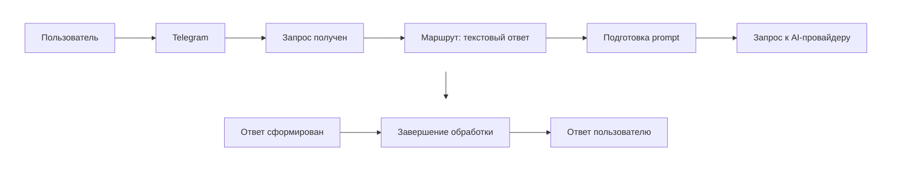
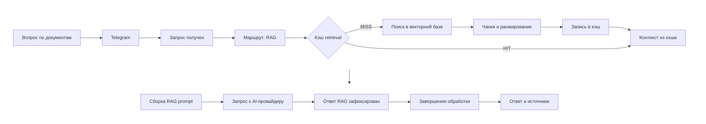
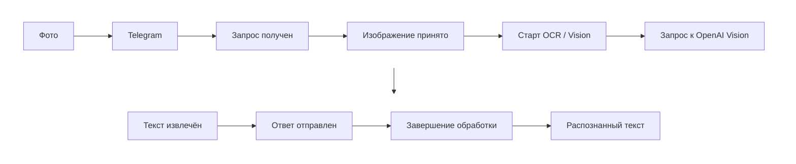
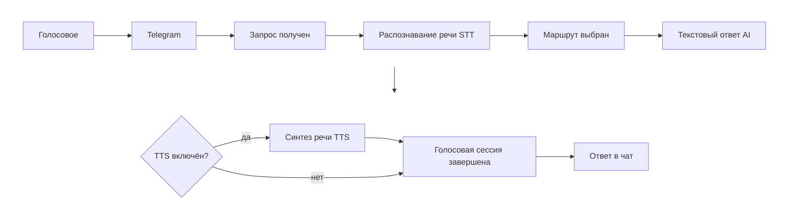

# 📖 Assistant Flow — руководство пользователя

Как пользоваться Telegram-ассистентом Assistant Flow. Развёртывание — [🚀 `DEPLOYMENT_GUIDE.md`](DEPLOYMENT_GUIDE.md); операционная консоль — [🎛️ `ADMIN_GUIDE.md`](ADMIN_GUIDE.md).

**Статус:** актуально на 2026-09-15.

---

## 🎯 1. Назначение

Assistant Flow — мультимодальный AI-ассистент в Telegram:

- текстовый диалог;
- RAG — вопросы по корпоративной базе знаний;
- OCR / Vision — текст с фотографий;
- голос (STT/TTS), если включено оператором;
- генерация изображений.

---

## 🔌 2. Подключение к боту

Система должна быть уже запущена ([DEPLOYMENT_GUIDE.md](DEPLOYMENT_GUIDE.md)).

1. Найдите в Telegram бота по **@username**, который задал оператор в BotFather (в репозитории имени нет).
2. **Start** или `/start`.
3. `/help` — режимы и примеры.

Если бот не отвечает — оператору: [⚙️ `OPERATIONS.md`](OPERATIONS.md) § «Типовые проблемы» (токен, restart).

---

## 🧭 3. Сценарии (схемы)

Операционные потоки: стадии соответствуют `processing_logs` и карточкам в консоли (разделы **Текст**, **RAG**, **Логи**). Это не полная архитектурная схема — внутренние вызовы сервисов свёрнуты.

*Этапы pipeline отражаются в `processing_logs` и доступны в операционной консоли.*

### Текст

*Стадии в логах:* `intake_received` → `route_selected` → `processing_done` → `text_answer_done`.

### RAG

*Стадии в логах:* `intake_received` → `route_selected` → `rag_answer_done` (в `details`: cache HIT/MISS, latency retrieval, чанки) → `processing_done`. При включённой памяти возможны `memory_load_started` / `memory_load_done`.

### OCR (OpenAI Vision)

*Стадии в логах:* `intake_received` → `image_received` → `ocr_started` → `ocr_done` → `ocr_response_sent` → `processing_done`. Локальный OCR не используется.

### Голос (STT → текст → опционально TTS)

*Стадии в логах:* `intake_received` → `stt_started` → `stt_completed` → `route_selected` → `text_answer_done` → `tts_started` / `tts_skipped` / `tts_completed` → `voice_processing_done`.

---

## 📜 4. Команды Telegram

| Команда | Действие |
|---------|----------|
| `/start` | Приветствие |
| `/help` | Справка по режимам |
| `/mode text` | Диалог и генерация изображений |
| `/mode rag` | Вопросы по базе знаний |
| `/mode ocr` | Распознавание текста на фото |
| `/stats` | Статистика индекса (RAG) |
| `/reset` | Сброс режима и in-memory RAG + ротация диалоговой сессии |
| `/clear` | Очистка контекста RAG (см. `/help`) |

> 💡 `/reset` также завершает текущую диалоговую сессию памяти: следующий диалог начинается с чистой историей (в консоли видно событие `memory_session_cleared` — раздел [🎛️ `ADMIN_GUIDE.md`](ADMIN_GUIDE.md) § Memory).

---

## 💬 5. Текстовый режим (`/mode text`)

- Вопросы на естественном языке.
- «Нарисуй…» — генерация изображения.
- Память диалога — если включена оператором (PostgreSQL).

**Пример:** «объясни простыми словами, что такое фотосинтез».

<em>
Пример текстового ответа Telegram-ассистента в режиме обычного диалога.
</em>

---

## 🔍 6. RAG (`/mode rag`)

Оператор заранее загружает документы ([🎛️ `ADMIN_GUIDE.md`](ADMIN_GUIDE.md) § Документы).

1. `/mode rag`.
2. Вопрос по содержимому проиндексированных файлов.
3. Ответ + блок **Источники**.

**Пример:** «дай полную сводку по компании НоваТех» (если такие документы есть в базе).

Без индексации — fallback без релевантных источников.

<em>
RAG-ответ Telegram-ассистента на основе корпоративной базы знаний Assistant Flow.
</em>

---

## 📄 7. Распознавание текста (OCR)

OpenAI Vision; локальный Tesseract не используется.

**Режим OCR:** `/mode ocr` → фото (подпись необязательна).

**В text/rag:** фото + подпись «распознай текст», «OCR», «извлеки текст» и т.п.

**Ответ:** блок «Распознанный текст:». В `/mode ocr` подпись может уточнить задание для vision (один вызов API).

**Примеры:** фото договора; фото + «объясни простыми словами, что написано».

**Ограничения:** размытие, рукопись, мелкий шрифт, сложные таблицы. RAG по картинке без OCR не выполняется.

<em>
Пример OCR-обработки изображения в Telegram: распознавание текста средствами OpenAI Vision.
</em>

---

## 🔊 8. Голос

При включённом аудио в окружении: голосовое → текст (и опционально озвучка). По умолчанию в демо — отключено.

<em>
Пример голосового взаимодействия с Telegram-ассистентом: распознавание речи и генерация аудио-ответа.
</em>

---

## 🖼️ 9. Генерация изображений

`/mode text` → «нарисуй слона в посудной лавке» → изображение в чате.

<em>
Пример генерации изображения Telegram-ассистентом по текстовому запросу пользователя.
</em>

---

## 🧠 10. Память диалога

- История в PostgreSQL (если настроено).
- Контекст для модели ограничен по размеру — ответы остаются устойчивыми и предсказуемыми.
- `/reset` — начать диалог заново (см. § 4).

Как память видна оператору — [🎛️ `ADMIN_GUIDE.md`](ADMIN_GUIDE.md) § Memory.

---

## 📚 11. См. также

- [🏠 `README.md`](../README.md) — точка входа в проект.
- [🎛️ `ADMIN_GUIDE.md`](ADMIN_GUIDE.md) — руководство администратора консоли.
- [🎬 `SYSTEM_DEMO.md`](SYSTEM_DEMO.md) — скриншоты и типовой сценарий.
- [🧭 `DEMO_ROUTE.md`](DEMO_ROUTE.md) — маршрут проверки демо.
- [🏗️ `ARCHITECTURE.md`](ARCHITECTURE.md) — устройство системы.