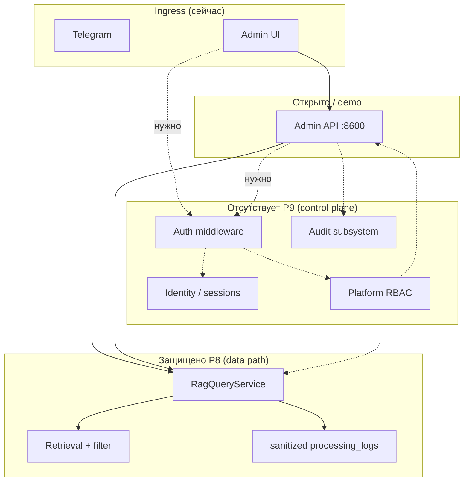

# Identity & Security Architecture — Assistant Flow (P9.0)

**Статус:** platform architecture (planning only, без runtime auth/IAM).  
**Дата:** 2026-05-19  
**Предшественник:** [security_rbac_design.md](security_rbac_design.md) (P8 retrieval/RAG security).  
**Связанные артефакты:** [SECURITY_NOTES.md](../SECURITY_NOTES.md), [security_walkthrough.md](../security/security_walkthrough.md).

---

## 1. Позиционирование

Assistant Flow — **single-tenant AI operations platform** с заделом под future multi-tenant evolution.

После P8 платформа **security-aware** на уровне retrieval, ingestion, masking и logging, но **не имеет control plane** для identity, authentication, platform RBAC и audit.

```text
P8  = data-path security (retrieval, logs, visibility)
P9  = control-plane security (identity, auth, RBAC, audit)
```

P9.0 не внедряет код auth. Цель — инженерная модель для P9.1–P9.7.

---

## 2. Current state (после P8)

### 2.1 Реализованный security foundation

| Слой | Состояние | Ключевые компоненты |
|------|-----------|---------------------|
| Retrieval policy | ✅ runtime | `policy_resolver`, `RetrievalSecurityContext`, `result_filter`, Chroma `where` |
| Visibility ingestion | ✅ runtime | upload `visibility`, default `internal`, chunk/vector metadata |
| Pre-LLM masking | ✅ runtime | `mask_common_pii` перед LLM |
| Log sanitization | ✅ runtime | `log_sanitizer`, operational / `forensic_admin` |
| Cache isolation | ✅ runtime | fingerprint `role\|scope\|vis` |
| Diagnostics | ✅ runtime | visibility distribution, security summary, redaction markers |
| Verification | ✅ smoke | `test_p8_1` … `test_p8_4` |

### 2.2 Существующие заделы в схеме БД (не подключены к control plane)

| Артефакт | Назначение | Проблема |
|----------|------------|----------|
| `app_users` | UUID, `telegram_user_id`, `role` (`user` \| `admin`) | Не используется policy resolver / Admin API auth |
| `chat_sessions` / `chat_messages` | Memory v1 | Нет RBAC на чтение; PII в content |
| `documents.uploaded_by` | FK на `app_users` | Частично; upload без principal |
| `processing_logs` | Lifecycle observability | Не audit trail; mutable; нет actor binding |

### 2.3 Trust gaps (критичные)

1. **Admin API (8600)** — нет authentication; любой с сетевым доступом = полный оператор.
2. **Admin UI (8080)** — нет login; доверяет открытому API.
3. **Identity** — retrieval role из env, не из `app_users` / сессии.
4. **RBAC** — только retrieval-роли (`guest` \| `employee` \| `admin`); нет scopes на API, ingestion, settings, audit.
5. **Audit** — `processing_logs` ≠ immutable security audit; нет auth events, document access log.
6. **Multi-tenant** — не заложен `tenant_id`; corpus и cache глобальные.
7. **Service accounts** — нет модели для bot-to-bot / automation API.

### 2.4 Диаграмма: текущие vs целевые границы



---

## 3. Identity model

### 3.1 First-class entities

| Сущность | Описание | Источник истины (целевой) |
|----------|----------|---------------------------|
| **PlatformUser** | Учётная запись платформы (UUID) | `app_users` → расширение |
| **Principal** | Субъект запроса в runtime (user, service, anonymous) | JWT claims / session |
| **Operator** | PlatformUser с правами на Admin API / UI | RBAC role `operator`+ |
| **EndUser** | Потребитель RAG (Telegram, future channels) | PlatformUser + channel links |
| **ServiceAccount** | Автоматизация, smoke, integrations | отдельная таблица `service_accounts` |
| **Organization** (future) | Tenant / org boundary | `organizations` (P9.6+) |
| **ChannelIdentity** | Привязка внешнего id | `user_channel_identities` |

### 3.2 PlatformUser (эволюция `app_users`)

Рекомендуемые поля (bounded migration в P9.1):

```text
id UUID PK
email TEXT UNIQUE NULL          -- для Admin UI local auth
password_hash TEXT NULL         -- только local auth; nullable для Telegram-only
display_name TEXT
status active|suspended|deleted
platform_role TEXT              -- см. RBAC §5 (не путать с retrieval role)
created_at, updated_at, last_login_at
```

**Не смешивать** `platform_role` и `retrieval_role`: один пользователь может иметь `platform_role=operator` и политику retrieval `employee` для тестов.

### 3.3 Channel identities (Telegram и др.)

```text
user_channel_identities (
  id UUID,
  user_id UUID FK → app_users,
  channel TEXT,              -- telegram | web | api
  external_user_id TEXT,     -- telegram_user_id как строка
  external_chat_id TEXT,
  metadata JSONB,
  UNIQUE (channel, external_user_id)
)
```

Текущий `telegram_user_id` в lifecycle/logs остаётся как **внешний идентификатор канала**, не как platform identity.

Policy resolver P9.2+:

```text
telegram_user_id → ChannelIdentity → PlatformUser → RetrievalSecurityContext + platform permissions
```

### 3.4 Session lifecycle

| Тип сессии | Назначение | Хранение |
|------------|------------|----------|
| **AdminSession** | Browser / Admin UI | HttpOnly cookie + server-side session store **или** refreshable JWT pair |
| **ChatSession** | RAG memory (`chat_sessions`) | PostgreSQL (уже есть) |
| **ServiceToken** | API automation | hashed token + scopes + expiry |

Инварианты:

- Admin session ≠ chat session.
- Rotation refresh token; revoke on logout / password change.
- Привязка сессии к `user_id`, `ip_hash` (optional), `user_agent` (optional) для audit.

### 3.5 Роли сущностей (кто есть кто)

| Термин | Определение |
|--------|-------------|
| **guest** (retrieval) | Политика доступа к corpus, не обязательно отдельный PlatformUser |
| **employee** (retrieval) | Дефолтная политика сотрудника |
| **user** | EndUser с PlatformUser |
| **operator** | Может управлять документами, смотреть logs (redacted) |
| **admin** | Полный доступ к платформе в single-tenant |
| **auditor** | Read-only: logs, audit, forensic (bounded) |
| **superadmin** (optional) | Break-glass, settings, user management — только single-tenant |

---

## 4. Trust boundaries

| Зона | Trust level | Auth сегодня | Auth целевой (P9) | Сетевые допущения | Риски | Controls |
|------|-------------|--------------|-------------------|-------------------|-------|----------|
| **Telegram ingress** | Низкий (публичный мессенджер) | Bot token only | ChannelIdentity + rate limit | Internet | Spoofing chat id (редко); PII в чате | Verify update; map to PlatformUser; retrieval policy |
| **Admin UI** | Высокий (оператор) | Нет | AdminSession + RBAC | LAN / VPN / TLS | XSS, stolen session | CSP, HttpOnly, short TTL, MFA (future) |
| **Admin API** | Высокий | Нет | Bearer JWT / session cookie middleware | Internal + reverse proxy | Full corpus leak | `require_permission`; audit every mutation |
| **RAG pipeline** | Средний (внутренний) | Implicit | Service identity + user context | compose internal | Bypass filter if no context | Mandatory `SecurityContext` from principal |
| **Vector stores** | Средний | Network only | mTLS / internal network (future) | compose ports | Direct Chroma query | Do not publish ports; API-only access |
| **PostgreSQL** | Высокий | Connection string | Least-privilege DB roles (future) | internal | SQL injection, dump | ORM/repos; no raw in UI |
| **processing_logs** | Средний | N/A | Write via lifecycle only; read via RBAC | internal | PII in historical rows | Sanitizer; tiered read; retention job |
| **Diagnostics / forensic** | Высокий | Нет | `audit:forensic` permission | via Admin API | Insider abuse | Separate audit log; justification field (future) |
| **LLM provider** | **Недоверенный** | API key | DPA; minimize context | Internet | Provider logging | Pre-LLM mask; no secrets in prompt |
| **Future public API** | Низкий–средний | API keys / OAuth | ServiceAccount + scopes | DMZ | Abuse, quota | Rate limit, WAF, tenant quota (P9.6) |

---

## 5. Auth architecture

### 5.1 Стратегия: local auth first

**Решение:** начать с **встроенной local authentication** для Admin UI / Admin API, без Keycloak на первом этапе.

Причины:

| Фактор | Local first | Keycloak-first (отклонено для P9.1–P9.3) |
|--------|-------------|------------------------------------------|
| Operational complexity | Низкая; fits demo compose | Тяжёлый стек, отдельный lifecycle |
| Single-tenant AF | Достаточно | Избыточно |
| Time-to-value P9 | Быстрый закрытый периметр Admin API | Зависимость от внешнего IdP |
| Portfolio / обучение | Прозрачный JWT/session flow | Скрывает platform auth в провайдере |
| Offline / air-gap demo | Работает | Требует IdP |

Keycloak / OIDC — **P9.7+**, как адаптер поверх абстракции `AuthProvider`, не как ядро.

### 5.2 Рекомендуемая модель токенов

```text
Access JWT  — короткий TTL (15–60 min), claims: sub, platform_role, permissions[], tenant_id?
Refresh     — HttpOnly cookie или opaque id в PG (7d), rotation on use
Service     — long-lived API key (hashed), scoped
```

Claims (минимум):

```json
{
  "sub": "<platform_user_uuid>",
  "role": "operator",
  "perms": ["documents:read", "documents:write", "logs:read"],
  "iat", "exp", "jti"
}
```

**Не класть** в JWT: retrieval corpus, chunk text, PII.

### 5.3 Admin UI auth flow (целевой)

```text
1. POST /api/auth/login { email, password }
2. Validate → issue access JWT + refresh cookie
3. React stores access in memory (не localStorage)
4. API calls: Authorization: Bearer <access>
5. 401 → refresh → retry once → login redirect
6. POST /api/auth/logout → revoke refresh
```

Параллельно: опциональный **bootstrap admin** через env `AF_BOOTSTRAP_ADMIN_EMAIL` (только first-run).

### 5.4 Telegram auth

Telegram **не заменяет** platform auth:

- `telegram_user_id` → `ChannelIdentity` → `PlatformUser` (auto-provision optional).
- Retrieval role: из `PlatformUser.retrieval_policy` или group mapping, fallback env (совместимость P8).
- Admin functions **недоступны** из Telegram без отдельной привязки operator.

### 5.5 Service auth

`ServiceAccount` + scoped API key для:

- smoke / CI;
- future webhooks;
- evaluation batch jobs.

Отдельный principal type в middleware: `principal.type = service`.

### 5.6 Future SSO / OAuth (P9.7)

```text
AuthProvider interface
  ├── LocalAuthProvider      (P9.2)
  ├── OidcAuthProvider       (P9.7)  ← Keycloak, Azure AD, Google Workspace
  └── ServiceKeyProvider     (P9.2)

/api/auth/oidc/login → redirect
/api/auth/oidc/callback → map external sub → PlatformUser (JIT provision)
```

Маппинг: `user_identities(provider, external_sub)` без переписывания RBAC.

---

## 6. RBAC architecture

### 6.1 Два слоя политик

```text
Platform RBAC     — кто может вызывать API / UI actions
Retrieval policy  — какие чанки попадают в RAG (P8, уже есть)
```

Связь: `PlatformUser` несёт `retrieval_policy_profile` (guest | employee | admin | custom).

### 6.2 Роли платформы (рекомендуемый набор)

| Роль | Назначение | Typical principal |
|------|------------|-------------------|
| `end_user` | Только каналы (Telegram) | Auto-provisioned |
| `employee` | End user + расширенный retrieval | Staff |
| `operator` | Documents, logs (operational), reindex | Ops |
| `admin` | Settings, retrieval backend, users | Platform admin |
| `auditor` | Read logs + audit + export (redacted) | Security / compliance |
| `superadmin` | Break-glass (optional, single-tenant) | Owner |

Роль `guest` остаётся **retrieval policy label**, не обязательно platform account.

### 6.3 Scopes (permission matrix — направление)

| Scope | guest / end_user | employee | operator | admin | auditor |
|-------|------------------|----------|----------|-------|---------|
| `retrieval:query` | public only | +internal | +internal | all | — |
| `documents:read` | — | — | ✓ | ✓ | ✓ |
| `documents:write` | — | — | ✓ | ✓ | — |
| `documents:visibility` | — | — | ✓ | ✓ | — |
| `ingestion:reindex` | — | — | ✓ | ✓ | — |
| `logs:read` | — | — | operational | full | ✓ |
| `logs:forensic` | — | — | — | ✓ | ✓ (bounded) |
| `settings:retrieval` | — | — | — | ✓ | — |
| `settings:platform` | — | — | — | ✓ | — |
| `users:manage` | — | — | — | ✓ | — |
| `audit:read` | — | — | — | ✓ | ✓ |
| `evaluation:run` | — | — | ✓ | ✓ | — |

**Реализовано (P9.4):** `services/security/rbac.py` + `require_permission(...)` в Admin API; матрица — [security/rbac_permissions.md](../security/rbac_permissions.md).

**Реализовано (P9.5):** `admin_audit_log` + `AuditService` + `/api/security/audit/*` — [security/audit_and_observability.md](../security/audit_and_observability.md).

### 6.4 Policy resolution flow

```text
HTTP Request
  → AuthMiddleware (validate JWT / session)
  → Principal(platform_user_id, roles, permissions)
  → Route handler
       ├─ Admin mutations → check permission + audit log
       └─ RAG proxy (if any) → build RetrievalSecurityContext from principal
```

### 6.5 Совместимость с P8

- `policy_resolver.resolve_role_for_telegram_user` → deprecated path; wrapper `resolve_retrieval_context(principal)`.
- Env overrides (`TELEGRAM_ADMIN_USER_IDS`) — **break-glass / demo only**, document as non-production.

---

## 7. Audit architecture

### 7.1 Разделение observability и audit

| Подсистема | Таблица / канал | Mutable | Назначение |
|------------|-----------------|---------|------------|
| **Lifecycle / ops** | `processing_logs` | append (+ details JSON) | RAG telemetry, latency, debugging |
| **Security audit** | `audit_events` (новая) | append-only | кто, что, когда, outcome |
| **Auth audit** | `auth_events` (новая) | append-only | login, logout, fail, refresh |
| **Forensic access** | `audit_events` type=forensic | append-only | доступ к полным diagnostics |

`processing_logs` **не заменяется** — audit ссылается на `execution_id` / `intake_event_id` где нужно.

### 7.2 Категории audit events

```text
auth.login.success | auth.login.failure | auth.logout | auth.token.refresh
document.upload | document.delete | document.reindex | document.visibility_change
retrieval.policy_denied | retrieval.forensic_view
settings.change | user.role_change | user.create | user.suspend
admin.api.error | service.key.created
```

Поля события (минимум):

```text
id, occurred_at, actor_id, actor_type, action, resource_type, resource_id,
outcome, ip_hash, user_agent, metadata JSONB (без PII raw)
```

### 7.3 Forensic model

- Forensic diagnostics (полный query, bounded chunk text) — только при `logs:forensic` + **audit запись** «кто открыл».
- Совместить с P8 `sanitization_policy=forensic_admin`: forensic в API только после permission check.
- Optional: `justification` text (оператор вводит причина просмотра).

### 7.4 Retention

| Данные | Рекомендация |
|--------|--------------|
| `auth_events` | 90–365 дней |
| `audit_events` | 1 год (настраиваемо) |
| `processing_logs` | tiered: hot 30d → archive |
| Historical pre-P8 logs | documented; no retro-delete без policy |

Immutable: запрет `UPDATE`/`DELETE` на `audit_events` на уровне приложения; опционально DB trigger (P9.5).

### 7.5 Связь с существующим lifecycle

```text
intake_event → execution_id → processing_logs (technical)
                         ↘ audit_events (security-relevant actions)
```

Retrieval security stdout (`retrieval_filtered`) остаётся telemetry; дублировать счётчики в `audit_events` только при deny policy на sensitive doc (optional P9.5).

---

## 8. Multi-tenant implications (design only)

### 8.1 Совместимо сейчас (после доработки)

- Visibility metadata (`public` / `internal` / `restricted`) — обобщается до tenant-scoped labels.
- `RetrievalSecurityContext` + fingerprint — добавить `tenant_id` в fingerprint.
- Log sanitizer — не зависит от tenant.
- RBAC permission model — естественно расширяется `tenant_id` в claims.

### 8.2 Потребует redesign

| Область | Проблема single-tenant |
|---------|------------------------|
| Vector index | Один Chroma collection / FAISS index на всех |
| `documents` / corpus | Нет `tenant_id` |
| Retrieval cache SQLite | Глобальный файл |
| Env-based Telegram roles | Не масштабируется |
| Admin UI | Один instance = один tenant |
| `platform_settings` | Глобальные |

### 8.3 Security assumptions single-tenant only

- Оператор видит весь corpus.
- Нет row-level isolation в PostgreSQL.
- Shared LLM API key.
- Demo ports на host.

### 8.4 Направление P9.6 (tenant-aware security)

```text
organizations(id, name, settings)
  → все documents.tenant_id
  → vector namespace per tenant
  → JWT claim tenant_id + membership table
  → cache partition key includes tenant_id
```

Не смешивать P9.6 с P9.1–P9.5 single-tenant delivery.

---

## 9. Recommended implementation roadmap

| Фаза | Scope | Ключевые deliverables | Out of scope |
|------|-------|----------------------|--------------|
| **P9.0** ✅ | Architecture | Этот документ | Любой runtime auth |
| **P9.1** ✅ | Identity foundation implemented — см. §63 `PROJECT_STATE.md` | OAuth |
| **P9.2** ✅ | Auth middleware enforcement, `/api/auth/me`, protected routes — см. `docs/security/auth_modes.md` | JWT refresh, Admin UI login |
| **P9.3** | Admin UI auth | Login, logout, route guard, token refresh | SSO |
| **P9.4** | Platform RBAC | Permissions, защита routes, связь с retrieval context | Postgres RLS |
| **P9.5** | Audit trail | `audit_events`, `auth_events`, hooks на mutations, forensic audit | SIEM export |
| **P9.6** | Tenant-aware security | `tenant_id`, index partitioning, cache partition | Full billing |
| **P9.7** | SSO/OAuth | `OidcAuthProvider`, Keycloak optional | Custom IAM product |

Зависимости:

```text
P9.1 → P9.2 → P9.3
         ↘ P9.4 → P9.5
P9.6 после P9.4
P9.7 после P9.3
```

### 9.1 Критерии готовности single-tenant production-style (после P9.5)

- Admin API недоступен без auth.
- Каждая mutation (upload, reindex, settings) в `audit_events`.
- Retrieval context строится из principal, не только env.
- Документированы break-glass и known limitations.

---

## 10. Связь с документацией P8

| Документ | Роль |
|----------|------|
| [security_rbac_design.md](security_rbac_design.md) | Retrieval/RAG security (P6.7–P8) |
| [identity_and_security_architecture.md](identity_and_security_architecture.md) | Platform identity & control plane (P9) |
| [security_walkthrough.md](../security/security_walkthrough.md) | Demo P8 increment |
| [SECURITY_NOTES.md](../SECURITY_NOTES.md) | Операционные ограничения |

При реализации P9.2+ обновить `security_rbac_design.md` §2 (устаревший audit «без security_context») ссылкой на актуальный runtime.

---

## 11. Резюме для оператора

P9.0 фиксирует: **Assistant Flow нуждается в control plane**, отдельном от уже реализованного data-path security P8. Первый шаг реализации — identity в PostgreSQL и local auth для Admin API, без преждевременного Keycloak. Multi-tenant и SSO — явно отложены, но архитектура им не противоречит.
