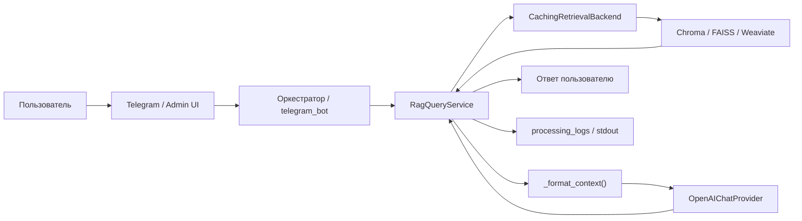

# Security & RBAC — архитектурный foundation (P8 groundwork)

**Статус:** architectural audit + design only (без production IAM, без миграций, без runtime-реализации RBAC).  
**Дата:** 2026-05-19  
**Связанные артефакты:** P6.7 `services/retrieval_security/`, [SECURITY_NOTES.md](../SECURITY_NOTES.md), [ARCHITECTURE.md](../ARCHITECTURE.md).

---

## 1. Цель этапа

Подготовить bounded foundation для перехода:

**observable AI-platform → security-aware AI-platform**

Без giant refactor. Без JWT/OAuth/production IAM. Фокус:

- role-aware retrieval (контракты и точки внедрения);
- безопасный RAG (границы доверия, утечки контекста);
- PII masking (стратегия, не NLP);
- retrieval security (наследование P6.7);
- безопасное логирование и observability;
- roadmap внедрения RBAC.

---

## 2. Текущее состояние runtime (audit)

### 2.1 Цепочка retrieval → LLM



| Этап | Файл / компонент | Что происходит |
|------|------------------|----------------|
| Вызов retrieval | `interfaces/telegram_bot.py` → `rag_service.answer()` | Основной пользовательский RAG-путь; **`security_context` не передаётся** |
| Поиск | `services/rag_query_service.py` → `_retrieve_raw` → `_similarity_search_with_timeout` | `RetrievalBackend.search(query, top_k, security_context=…)` |
| Обёртка кэша | `services/cache/caching_retrieval_backend.py` | Ключ fingerprint + опциональный сегмент `retrieval_security=…` |
| Vector backend | `services/retrieval/chroma_backend.py`, `faiss_backend.py`, `weaviate_backend.py` | Chroma: `where` до query; FAISS: oversample ×8 + post-filter |
| Post-filter | `services/retrieval_security/result_filter.py` | Источники, metadata_filters, required_tags |
| Контекст для LLM | `rag_query_service._format_context(filtered)` | Полный текст чанков + `source` в system prompt |
| Hybrid (опционально) | `services/hybrid_retrieval/hybrid_context_service.py` | Добавляет memory-секцию при `enable_hybrid_retrieval` |
| LLM | `rag_query_service._rag_llm` | System prompt содержит весь `КОНТЕКСТ` (KB ± memory) |
| Диагностика | `services/rag_types.RagRequestDiagnostics` | `to_log_details()` → lifecycle; `emit_stdout()` |

**Другие вызывающие retrieval (без Telegram):**

- `services/evaluation_service.py`, `services/evaluation/rag_evaluation_service.py` — offline eval;
- `scripts/evaluate_rag_smoke.py`, `scripts/rag_smoke_test.py`;
- Admin UI не вызывает RAG напрямую — только читает `processing_logs` и метаданные документов.

### 2.2 Lifecycle logging

| Хранилище | Содержимое с риском PII |
|-----------|-------------------------|
| `processing_logs.details` (PostgreSQL) | `user_input` (полный текст), `retrieval_ready_query` (до 16k), `chunk_text_full` (до 12k на чанк в БД; API slim до 10k), `answer_text`, STT `transcript` |
| `intake_events.raw_payload` | `text_preview` (200 символов) |
| `chat_sessions` / `chat_messages` | Полные реплики диалога (memory v1) |
| `storage/cache/assistant_cache.sqlite3` | Сериализованные vector hits с **полным телом чанков** |
| stdout | `rag diagnostics`, `retrieval_security:` события, query_preview |
| Chroma / FAISS / Weaviate | Эмбеддинги + текст чанков индексированных документов |
| Evaluation import | Снимки RAG-turn из logs |

### 2.3 Фактически открытые API (demo)

Admin API (`admin_api/app.py`, порт **8600**) — **без аутентификации**:

| Префикс | Риск |
|---------|------|
| `GET /api/health`, `/api/overview`, `/api/summary` | Операционная разведка |
| `GET /api/logs/recent` | **Полные пользовательские запросы и чанки** (после slim, но объёмно) |
| `GET/POST /api/documents/*` | Чтение/загрузка/реиндекс корпуса |
| `PUT /api/retrieval/*` | Смена backend и tuning |
| `GET/POST /api/evaluation/*` | RAG-turns, RAGAS, метрики |
| `GET /api/sessions/*` | Memory / forensic по сессиям |
| `GET /api/preview` | Превью ассетов |

В demo-compose на хост публикуются также Postgres (**5433**), Chroma (**8001**), Weaviate (**8089**).

### 2.4 Role isolation — текущие пробелы

1. **Telegram:** все пользователи делят один knowledge base; `rag_service.answer(...)` без `security_context` → `RetrievalSecurityContext.permissive_default()` (роль `admin`, unrestricted).
2. **Нет привязки** `telegram_user_id` → role / allowed_sources.
3. **Retrieval cache:** изоляция только если fingerprint security-сегмента различается; при permissive — общий кэш на всех.
4. **Индексация:** `chunk_metadata.apply_retrieval_metadata_contract` выставляет `visibility=unspecified`, `tags=[]` — фильтры P6.7 не активны до явного обогащения metadata.
5. **Masking:** `mask_common_pii*` существует, но **не подключён** к RAG/LLM/logs (только smoke `scripts/test_retrieval_security_smoke.py`).

### 2.5 Существующий задел P6.7

Уже реализовано (не дублировать в P8 implementation pass):

- `RetrievalSecurityContext` — role, allowed_sources, retrieval_scope, metadata_filters, required_tags;
- Chroma `where`, post-filter, cache fingerprint;
- Телеметрия stdout: `retrieval_scope_applied`, `retrieval_filtered`, `retrieval_denied_source`, `masking_applied`;
- Константы ролей: `ROLE_GUEST`, `ROLE_EMPLOYEE`, `ROLE_ADMIN` (идентификаторы политик, не IAM).

---

## 3. Trust boundaries (operational flow)

Для каждого этапа: риски, утечки, рекомендуемые ограничения.

```text
Пользователь
  → Telegram / Admin UI
  → orchestrator (telegram_bot / PromptOrchestrator)
  → retrieval (RagQueryService + backends)
  → vector backend (Chroma / FAISS / Weaviate)
  → LLM (внешний провайдер)
  → response
  → logs (Postgres, stdout, cache SQLite)
  → observability (Admin API → React)
```

| Граница | Риски | Возможные утечки | Рекомендуемые ограничения |
|---------|-------|------------------|---------------------------|
| **Пользователь → канал** | Подмена identity в Telegram; shared device | Запросы с PII в открытом чате | Будущий mapping user→role; не хранить лишнее в чате |
| **Telegram → bot** | Нет auth кроме bot token | Любой в чате → RAG по всему корпусу | Rate limit; режимы; security_context по user |
| **Admin UI → API** | Порт 8080/8600 без TLS/auth | Полный corpus + logs + sessions | Reverse proxy, OAuth2-proxy, IP allowlist |
| **bot → RagQueryService** | Permissive retrieval | Чужие документы в ответе | Policy resolver до `answer()` |
| **retrieval → vector DB** | Прямой доступ к порту Chroma на хосте | Обход application filter | Сеть: только internal compose; не публиковать порты |
| **retrieval → cache** | Cross-tenant cache hit | Чанки другой роли из SQLite cache | Fingerprint role/scope; invalidate при смене политики |
| **RagQueryService → LLM** | **Data processor boundary** | Полный KB context + memory уходит провайдеру | Pre-LLM masking; минимизация context; DPA с провайдером |
| **LLM → response** | Hallucination с PII из контекста | Повтор чувствительных данных | Post-filter ответа (опционально, P8+) |
| **→ processing_logs** | Over-logging | `user_input`, `chunk_text_full`, `retrieval_ready_query` | Sanitization layer; tiered diagnostics |
| **→ Admin observability** | Insider threat | Оператор видит всё через `/api/logs` | RBAC на API; redacted views для guest operators |

**Критическая внешняя граница:** LLM-провайдер (OpenAI и др.) — считать **недоверенной зоной** для сырых PII; контекст передаётся по сети и может логироваться у провайдера.

---

## 4. RBAC insertion points (будущее внедрение)

Приоритет внедрения (сверху вниз — без переписывания pipeline):

| # | Точка | Файл | Действие (bounded) |
|---|-------|------|---------------------|
| 1 | **Policy resolver** (новый тонкий модуль) | `services/retrieval_security/policy_resolver.py` (предложение) | `telegram_user_id` / API principal → `RetrievalSecurityContext` |
| 2 | **Telegram RAG entry** | `interfaces/telegram_bot.py` | Передавать `security_context=` в `answer()` |
| 3 | **RagQueryService** | `services/rag_query_service.py` | Pre-LLM masking hook; опционально mask в `to_log_details` |
| 4 | **Retrieval layer** | `services/retrieval/*_backend.py` | Уже принимают `security_context` — без изменений контракта |
| 5 | **Retrieval factory / manager** | `services/retrieval/factory.py`, `runtime_manager.py` | Проброс resolver; не смешивать с build-time config |
| 6 | **Retrieval cache** | `services/cache/caching_retrieval_backend.py`, `retrieval_cache_key.py` | Уже учитывает fingerprint — проверить при новых полях metadata |
| 7 | **Document indexing** | `services/admin_knowledge_indexer.py` | Запись security metadata в PG + vector meta при upload/reindex |
| 8 | **Document metadata (PG)** | `document_chunks.metadata`, `documents.metadata` | Схема ключей (JSONB, без миграции на этапе design) |
| 9 | **processing_logs** | `services/runtime_lifecycle_service.py`, `rag_types.to_log_details` | Sanitization policy по stage/route |
| 10 | **Admin API routes** | `admin_api/routes/*.py` | Dependency `require_role` (будущее); redacted logs для operator |
| 11 | **Retrieval settings** | `admin_api/routes/retrieval.py`, `platform_settings` | Политики по умолчанию / tenant (конфиг, не IAM) |
| 12 | **Evaluation** | `services/evaluation/*` | Явный permissive или изолированный dataset; не смешивать с prod logs |

**Не трогать в первом pass:** frontend auth, Postgres RLS, переписывание chunking, UI contract Admin console.

---

## 5. Предлагаемая модель security metadata (bounded)

Без миграций SQL. Расширение JSONB `metadata` на документах и чанках + mirror в vector metadata при индексации.

| Поле | Тип | Назначение |
|------|-----|------------|
| `allowed_roles` | `string[]` | Роли с правом retrieval (например `employee`, `admin`) |
| `document_visibility` | `enum string` | `public` \| `internal` \| `restricted` \| `unspecified` (default) |
| `contains_pii` | `bool` | Маркер оператора/ингеста: в чанке возможны PII |
| `requires_masking` | `bool` | Принудительное маскирование перед LLM и в логах |
| `security_scope` | `string` | Логический tenant/отдел (`hr`, `legal`, `default`) |
| `retrieval_scope` | `string` | Совместимость с `RetrievalSecurityContext.retrieval_scope` |

**Связь с P6.7:**

- `visibility` / `document_type` / `tags` уже есть в `chunk_metadata.apply_retrieval_metadata_contract`;
- `metadata_filters` в контексте могут ссылаться на `document_visibility`, `security_scope`;
- `required_tags` — для меток вроде `confidential`.

**Индексация (будущее):** Admin upload API принимает optional security block → `_chunk_metadata_snapshot_for_pg` + vector upsert.

---

## 6. PII masking strategy (proposal)

### 6.1 Существующие средства

`services/retrieval_security/masking.py` — regex: телефоны, email, длинные цифровые последовательности; телеметрия `masking_applied`.

### 6.2 Где применять masking

| Слой | Когда | Данные |
|------|-------|--------|
| **Pre-LLM** | После `_format_context`, до `_rag_llm` | Текст чанков в context; honor `requires_masking` / `contains_pii` |
| **Log sanitization** ✅ P8.3 | `services/security/log_sanitizer.py`, `to_log_details`, lifecycle, Admin API deps | `chunk_text_full`, `user_input`, `retrieval_ready_query`, `answer_text`, `transcript` |
| **Response post-filter** | После LLM, до Telegram (опционально P8.1) | Ответ модели, если политика role=guest |
| **Role-aware policy** | В policy resolver | `guest`: mask all PII heuristics; `employee`: mask only `requires_masking`; `admin`: no mask (ops) |

### 6.3 Особо опасные данные

- Паспорт/СНИЛС/ИНН-подобные длинные цифры (частично покрыто `_LONG_DIGITS`);
- Email, телефон;
- ФИО — **не** покрыто regex (нужен NER в будущем, вне scope);
- Полный текст загруженных HR/медицинских документов в `chunk_text_full`;
- STT transcript в voice pipeline;
- Memory `chat_messages.content`.

### 6.4 Telemetry: что не хранить raw

| Поле | Рекомендация |
|------|----------------|
| `chunk_text_full` | fingerprint + preview ≤220 для UI; full только при `admin` diagnostics flag |
| `retrieval_ready_query` | preview 200 в UI; full только в secured audit store |
| `user_input` | `query_preview` + hash |
| Cache SQLite value | Не кэшировать чанки с `requires_masking` без redacted payload |
| RAGAS / evaluation export | Strip PII перед export |

---

## 7. Logging & observability

### 7.1 Полезная security telemetry

- `role`, `retrieval_scope`, `allowed_sources` count (не список, если большой);
- `retrieval_filtered` / `retrieval_denied_source` counts (уже в P6.7);
- `masking_applied` kinds;
- `security_policy_id` / version (будущее);
- cache hit/miss **без** query text в ключе (только hash prefix — уже так).

### 7.2 Как не превратить observability в утечку

1. Разделить **operator tiers**: полные чанки только для `admin` principal.
2. Добавить `diagnostics_tier` в `to_log_details()` (summary vs forensic).
3. Исключить `retrieval_ready_query` из API по умолчанию (сейчас пишется в PG, но не в `_PRESERVED_DETAIL_KEYS` — не попадает в slim API, **остаётся в БД**).
4. Не логировать полный hybrid memory в `details` (сейчас v1.1 — только counts; сохранить инвариант).
5. Evaluation UI — не показывать raw PII из production logs без role check.

### 7.3 Безопасная диагностика retrieval context

Для RAG-консоли достаточно: `source`, `score`, `text_preview` (≤220), `text_fp`, `passed_filter`, backend id.  
`chunk_text_full` — opt-in forensic mode.

---

## 8. Bounded roadmap (без giant refactor)

| Фаза | Scope | Out of scope |
|------|-------|--------------|
| **P8.0** | Audit, trust boundaries, insertion points | Runtime changes |
| **P8.1** ✅ | Policy resolver, Telegram `security_context`, visibility filter, pre-LLM masking, log tier | JWT, UI login |
| **P8.2** ✅ | Metadata на upload, Admin UI visibility, ingestion stamp, diagnostics | Postgres RLS |
| **P8.3** ✅ | Central `log_sanitizer`, operational vs forensic tiers, lifecycle + API redaction | Admin API auth, Full IAM |
| **P8.4** ✅ | Security verification smoke + homework report; known limitations review | Cache policy, NLP PII detector |
| **P8.5** ✅ | Self-contained session logs; [security_walkthrough.md](../security/security_walkthrough.md) | Production IAM |

---

## 9. Связь с документацией

- Операции и порты: [OPERATIONS.md](../OPERATIONS.md)
- P6.7 код: `PROJECT_STATE.md` §36
- Unified roadmap: `PROJECT_STATE.md` §38.5 (**P8 — Security / RBAC groundwork**)
- Session log P8.0: [docs/cursor_sessions/2026-05-19_security-rbac-architecture-audit.md](../cursor_sessions/2026-05-19_security-rbac-architecture-audit.md)
- Session log P8.1: [docs/cursor_sessions/2026-05-19_p8-1-retrieval-security-wiring.md](../cursor_sessions/2026-05-19_p8-1-retrieval-security-wiring.md)
